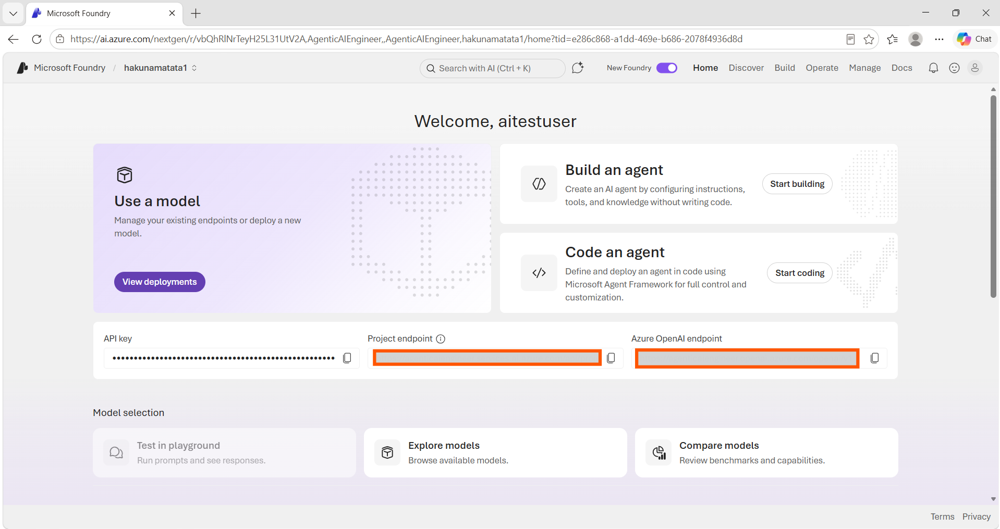
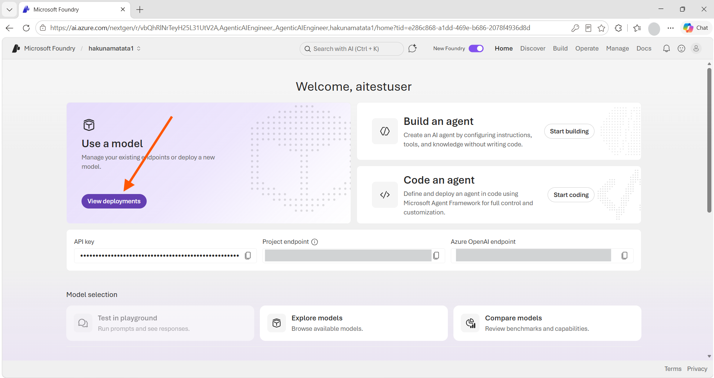
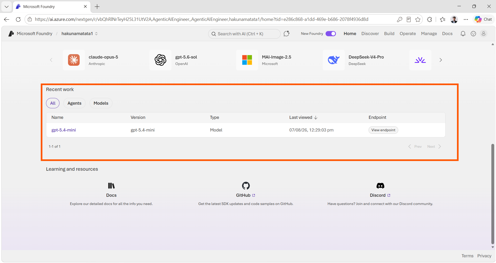
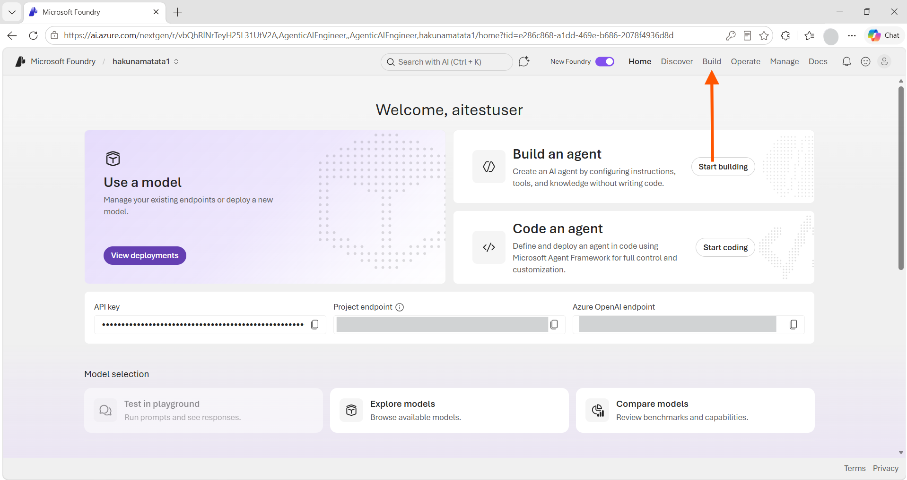
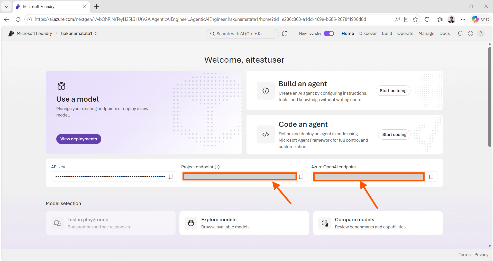
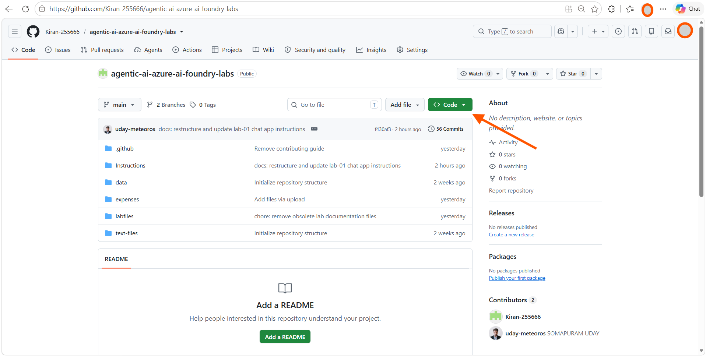
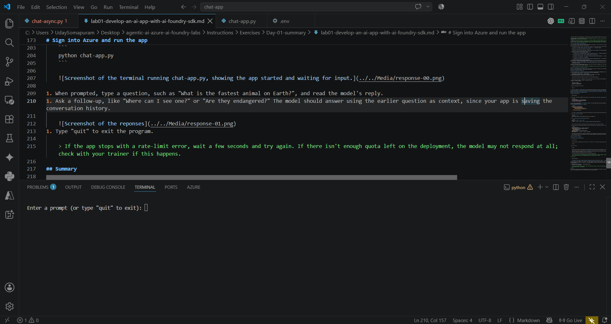
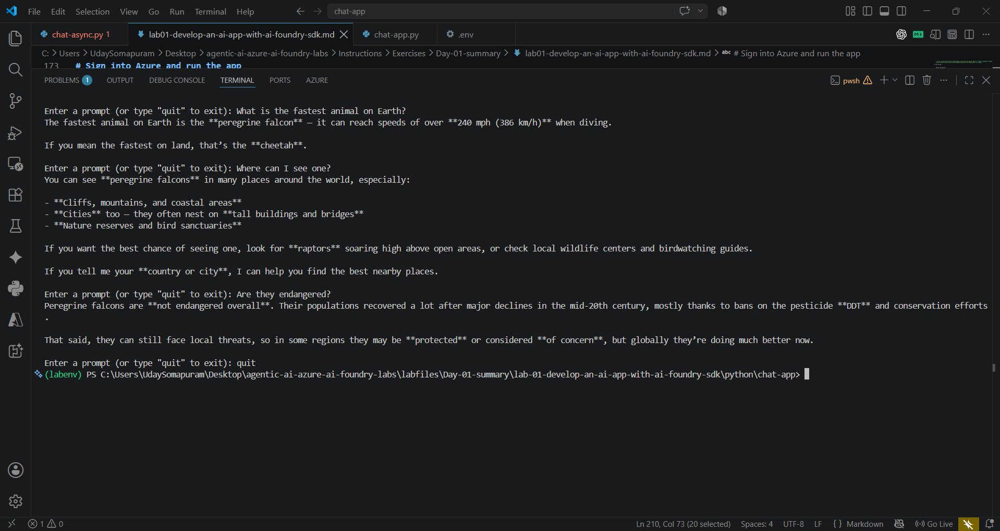

---
lab:
  title: Create a generative AI chat app
  description: Learn how to build a simple Python app that connects to a deployed model in Microsoft Foundry and chats with it.
  level: 200
  duration: 20
  islab: true
  status: 'released'
---

# Create a generative AI chat app

***Note: We have already updated the mentioned files with the code mentioned in the instructions, but we would highly suggest going through it before executing it***

In this exercise, you'll use the Microsoft Foundry Python SDK to build a small app that sends messages to a language model and shows its replies.

This exercise takes approximately **20** minutes.

> **Note**: Some of the technologies used in this exercise are in preview or in active development. You may see unexpected behavior, warnings, or errors.

Before starting this exercise, ensure you have:

## Prerequisites

- An active [Azure subscription](https://azure.microsoft.com/pricing/purchase-options/azure-account)
- [Python 3.13](https://www.python.org/downloads/) or later installed
- **Azure CLI** installed - [Install Azure CLI](https://aka.ms/installazurecliwindows)
- [Visual Studio Code](https://code.visualstudio.com/) installed on your local machine
- A web browser
- Basic familiarity with running commands in a terminal (you don't need to know Python already; the code is provided)

> A Foundry project with the **gpt-5.4-mini** model already deployed has been set up for you. In the next section, you'll locate your project's **endpoint** and **deployment name** in the Azure AI Foundry portal.
>
> **Important:** Copy both values into a local text file (for example, Notepad) and keep them somewhere safe, as you'll use them repeatedly throughout these labs.
>
> **Security note:** Treat your endpoint and deployment details as sensitive information. Never share them publicly, or paste them into online websites, AI assistants, forums, or chats. If you ever need to share screenshots or logs, mask or redact your endpoint, URLs, API keys, and any other sensitive information first.

# Find your project endpoint and deployment name

1. In a web browser, open the [Microsoft Foundry portal](https://ai.azure.com) at `https://ai.azure.com` and sign in with your Azure credentials. Close any tips or quick-start panes that appear the first time you sign in.

1. On the home page, select your project. (If you have more than one, pick the one your trainer or lab environment set up for this exercise.)

    

    Selecting your project takes you straight to its home page.

    

1. To confirm the name of your deployed model, use any of these:
    - Under **Use a model**, select **View deployments**

        

    - On the same home page scroll down, check the **Recent work** or **All** section

        

    - In the top menu, select **Build**, then **Models**

        

    It should read **gpt-5.4-mini**. Note this exact name too.
1. On the project home page, find the **Project endpoint** field and copy the value shown there directly. This is the web address your app will use to reach your project and model. (The **Azure OpenAI endpoint** field, shown next to it, works too if you prefer to use that instead.)

    

1. Copy both the endpoint and the deployment name into a local text file and save it somewhere safe. You'll paste these values into a configuration file in the next section, and you'll need them again in later exercises.

    > **Tip**: If you don't see a project or a gpt-5.4-mini deployment here, check with your trainer before continuing.

# Create a client application to chat with the model

You'll write a small Python app that connects to your Foundry project and holds a conversation with the deployed model. A **client application** here just means: code that runs on your machine and talks to the model over the internet.

### Prepare the application configuration

1. Open a web browser and go to the [chat-app lab files on GitHub](https://github.com/Kiran-255666/agentic-ai-azure-ai-foundry-labs).
1. On the repo page, select the green **`<> Code`** button, then select **Download ZIP**.

    
1. Once the download finishes, find the ZIP file and extract it to a folder on your computer.
1. Inside the extracted folder, open this path to find the chat app files:

    ```
    labfiles/Day-01-summary/lab-01-develop-an-ai-app-with-ai-foundry-sdk/python/chat-app
    ```

    You should see a code file, a configuration file for app settings, and a file listing the Python packages the app needs.

1. Open this `chat-app` folder in a terminal or command-line window.
1. Install the required packages:

    ```
    python -m venv labenv
    .\labenv\Scripts\Activate.ps1
    pip install -r requirements.txt
    ```

1. Open the configuration file to edit it:

    ```
    code .env
    ```

1. In the file, replace `your_project_endpoint` with the endpoint you saved earlier, and `your_model_deployment` with the deployment name you saved too.
1. Save with **Ctrl+S** (or right-click and choose Save), then close the editor while keeping your terminal open.

### Write code to connect to your project and chat with your model (Note: We have the code updated in the mentioned files instructions but verify before you start the execution, so that there are no indentation issues)

1. Open the app's code file:

    ```
    code chat-app.py
    ```

1. Near the top, some import statements are already there. Find the comment `# Add references` and add these lines below it, so your app can use the SDKs you installed:

    ```python
    # Add references
    from azure.identity import AzureCliCredential
    from azure.ai.projects import AIProjectClient
    from openai import AzureOpenAI
    ```

1. In the `main` function, under `# Get configuration settings`, the code already reads your project endpoint and model deployment name from the `.env` file you edited earlier. No changes needed there.
1. Find `# Initialize the project client` and add:

    ```python
    # Initialize the project client
    project_client = AIProjectClient(
        credential=AzureCliCredential(
            exclude_environment_credential=True,
            exclude_managed_identity_credential=True
        ),
        endpoint=project_endpoint,
    )
    ```

    This creates a connection between your app and the Foundry project, using your signed-in Azure identity instead of a password or key.

1. Find `# Get a chat client` and add:

    ```python
    # Get a chat client
    openai_client = project_client.get_openai_client(api_version="2024-10-21")
    ```

1. Find `# Initialize prompt with system message` and add:

    ```python
    # Initialize prompt with system message
    prompt = [
        {"role": "system", "content": "You are a helpful AI assistant that answers questions."}
    ]
    ```

    This line sets up the model's instructions before any conversation starts, telling it how to behave.

1. The code already has a loop that keeps asking for input until you type "quit". Inside that loop, find `# Get a chat completion` and add:

    ```python
    # Get a chat completion
    prompt.append({"role": "user", "content": input_text})
    response = openai_client.chat.completions.create(
        model=model_deployment,
        messages=prompt)
    completion = response.choices[0].message.content
    print(completion)
    prompt.append({"role": "assistant", "content": completion})
    ```

    Each time you ask something, this code adds your question to the conversation, sends the whole conversation to the model, prints the reply, and saves that reply too. Saving both sides of the conversation is what lets the model remember earlier questions when you ask a follow-up.

1. Save the file with **Ctrl+S**.

# Sign into Azure and run the app

1. Check whether you're already signed in:

    ```
    az account show
    ```

    If this shows your account details, skip to step 3. If it shows an error, or shows the wrong account, sign out first:

    ```
    az logout
    ```

1. Sign in to Azure:

    ```
    az login
    ```

    You need to do this even if your terminal session already knows who you are; the app itself needs its own sign-in. The first time you run this exercise, use this step directly. After that, always check with `az account show` first, and only run `az login` again if it's needed.

    Follow the prompts: open the sign-in link in a new tab, enter the code shown, and sign in using the account your trainer gave you. Back in the terminal, pick the subscription containing the Foundry project if you're asked to.

    If you're asked to pick a subscription or tenant, type **1** and press Enter.

    > If your account has access to subscriptions in more than one tenant, add the `--tenant` parameter instead. See [Sign into Azure interactively using the Azure CLI](https://learn.microsoft.com/cli/azure/authenticate-azure-cli-interactively) for details.

1. Run the app:

    ```
    python chat-app.py
    ```

    

1. When prompted, type a question, such as "What is the fastest animal on Earth?", and read the model's reply.
1. Ask a follow-up, like "Where can I see one?" or "Are they endangered?" The model should answer using the earlier question as context, since your app is saving the conversation history.

    
1. Type "quit" to exit the program.

    > If the app stops with a rate-limit error, wait a few seconds and try again. If there isn't enough quota left on the deployment, the model may not respond at all; check with your trainer if this happens.

## Summary

You found your Foundry project's endpoint and deployment name, then built a Python app that connects to a gpt-5.4-mini model and holds a back-and-forth conversation with it, using conversation history so the model can follow up on earlier questions.
