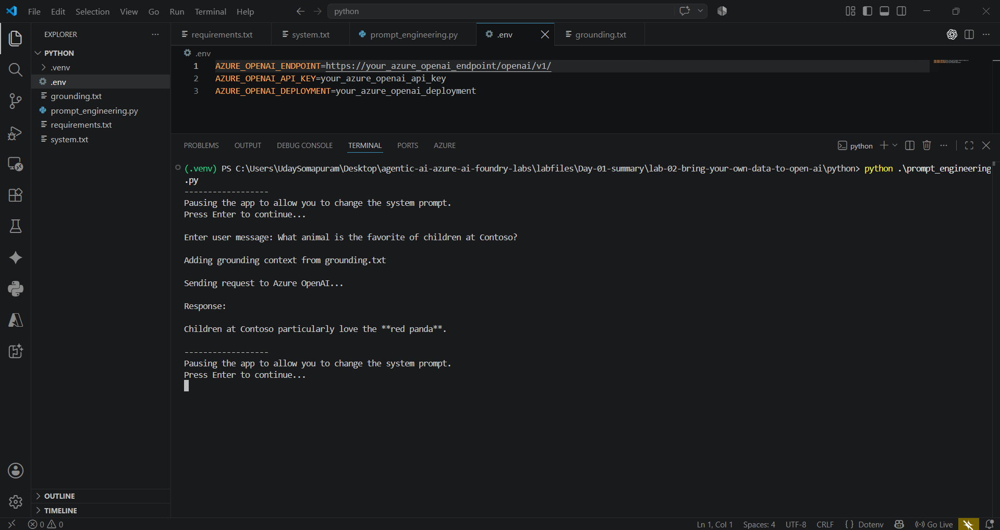

---
lab:
  title: Utilize prompt engineering in your app
  description: Learn how different prompt structures shape a generative AI model's response, then build a Python app to test them.
  level: 200
  duration: 30
  islab: true
  status: 'released'
---

# Utilize prompt engineering in your app

How you write a prompt has a direct effect on how an Azure OpenAI model responds. The model can tailor and format its output if you ask clearly, but the same request phrased two different ways can produce very different results.

In this exercise, you'll play the role of a developer on a wildlife marketing team. You're testing how generative AI can improve advertising emails and sort articles for your team. The prompt techniques you'll practice apply just as well to other use cases beyond this one.

This exercise takes approximately **30** minutes.

## Prerequisites

- An active [Azure subscription](https://azure.microsoft.com/pricing/purchase-options/azure-account)
- [Python 3.13](https://www.python.org/downloads/) or later installed
- **Azure CLI** installed. [Install Azure CLI](https://aka.ms/installazurecliwindows)
- [Visual Studio Code](https://code.visualstudio.com/) installed on your local machine
- A web browser
- Basic familiarity with running commands in a terminal (you don't need to know Python already; the code is provided)

> A Foundry project with a language model already deployed has been set up for you. If you completed the previous exercise, you may already have the **endpoint** and **deployment name** saved.
>
> **Important:** Copy both values into a local text file (for example, Notepad) and keep them somewhere safe, as you'll use them repeatedly throughout these labs.
>
> **Security note:** Treat your endpoint and deployment details as sensitive information. Never share them publicly, or paste them into online websites, AI assistants, forums, or chats. If you ever need to share screenshots or logs, mask or redact your endpoint, URLs, API keys, and any other sensitive information first.

# Find your project endpoint and deployment name

1. If you already saved your **endpoint** and **deployment name** from a previous exercise, skip ahead to **Explore prompt engineering techniques**. Otherwise, follow the steps below.
1. In a web browser, open the [Microsoft Foundry portal](https://ai.azure.com) at `https://ai.azure.com` and sign in with your Azure credentials. Close any tips or quick-start panes that appear the first time you sign in.
1. On the home page, select your project. (If you have more than one, pick the one your trainer or lab environment set up for this exercise.)

    

    Selecting your project takes you straight to its home page.

    

1. To confirm the name of your deployed model, use any of these:
    - Under **Use a model**, select **View deployments**

        

    - On the same home page scroll down, check the **Recent work** or **All** section

        

    - In the top menu, select **Build**, then **Models**

        

    Note this exact name too.
1. On the project home page, find the **Project endpoint** field and copy the value shown there directly. This is the web address your app will use to reach your project and model. (The **Azure OpenAI endpoint** field, shown next to it, works too if you prefer to use that instead.)

    

1. Copy both the endpoint and the deployment name into a local text file and save it somewhere safe. You'll paste these values into a configuration file later in this exercise, and you'll need them again in later exercises.

    > **Tip**: If you don't see a project or a deployment here, check with your trainer before continuing.

## Explore prompt engineering techniques

Start by testing a few prompt engineering techniques in the Chat playground to see how system instructions and examples influence the model's responses.

1. Open a web browser and go to `https://oai.azure.com`.

1. A pop-up may appear listing your available Azure OpenAI resources. If it appears, select the resource your trainer or lab environment set up for you. If no pop-up appears, continue to the next step.

   This takes you to the Microsoft Foundry **Overview** page for that resource.

1. In the left-hand panel, select **Playgrounds**.

1. On the **Chat playground** card, select **Try the Chat playground**.

   The Chat playground opens with two main areas:

   - **Setup**: Where you select your model deployment and configure the assistant's behavior.
   - **Chat history**: Where you submit prompts and view the model's responses.

1. In **Setup**, under **Deployment**, verify that your model deployment is selected.

1. In the **Give the model instructions and context** field, verify that the following default system prompt is present:

   ```text
   You are an AI assistant that helps people find information.
   ```

1. If the prompt isn't present, enter it manually.

   ```text
   You are an AI assistant that helps people find information.
   ```

1. If you modified the system prompt, select **Apply changes**. Otherwise, continue to the next step.

1. In the message box under **Chat history**, submit the following prompt:

   ```text
   What kind of article is this?
   ---
   Severe drought likely in California

   Millions of California residents are bracing for less water and dry lawns as drought threatens to leave a large swath of the region with a growing water shortage.

   In a remarkable indication of drought severity, officials in Southern California have declared a first-of-its-kind action limiting outdoor water use to one day a week for nearly 8 million residents.

   Much remains to be determined about how daily life will change as people adjust to a drier normal. But officials are warning the situation is dire and could lead to even more severe limits later in the year.
   ```

   Notice that the model typically describes the article rather than returning a single category label.

1. In **Setup**, replace the system prompt with the following:

   ```text
   You are a news classification assistant. Categorize each news article using a single category label. Respond with only one of the following categories: News, Sports, Entertainment, Technology, Business, Health, Science, or Other.
   ```

1. Select **Add section**, and then select **Examples**.

1. Add the following example:

   **User:**

   ```text
   What kind of article is this?
   ---
   New York Baseballers Wins Big Against Chicago

   New York Baseballers mounted a big 5-0 shutout against the Chicago Cyclones last night, solidifying their win with a 3 run homerun late in the bottom of the 7th inning.

   Pitcher Mario Rogers threw 96 pitches with only two hits for New York, marking his best performance this year.

   The Chicago Cyclones' two hits came in the 2nd and the 5th innings but were unable to get the runner home to score.
   ```

   **Assistant:**

   ```text
   Sports
   ```

1. Add a second example:

   **User:**

   ```text
   Categorize this article:
   ---
   Joyous moments at the Oscars

   The Oscars this past week were quite something!

   Though a certain scandal might have stolen the show, this year's Academy Awards were full of moments that filled us with joy and even moved us to tears. These actors and actresses delivered some truly emotional performances, along with some great laughs, to get us through the winter.

   From Robin Kline's history-making win to a full performance by none other than Casey Jensen herself, don't miss tomorrow's rerun of all the festivities.
   ```

   **Assistant:**

   ```text
   Entertainment
   ```

1. Select **Apply changes**.

1. An **Update system message?** dialog appears, informing you that updating the system message will start a new chat session and previous messages won't be included in new API requests. Select **Continue**.

1. In **Chat history**, notice that a new chat session has started. The message **The assistant setup has been updated. Previous messages won't be used as context for new queries.** is displayed.

1. In **Chat history**, resubmit the same drought article prompt from earlier.

   The updated system instructions and examples guide the model to respond with a consistent category label, such as:

   ```text
   News
   ```

   Depending on the model version, the exact wording may vary, but the response should follow the classification format defined by the system prompt and examples.

1. In **Setup**, restore the default system prompt:

   ```text
   You are an AI assistant that helps people find information.
   ```

   Remove the examples, and then select **Apply changes**.

1. If prompted with the **Update system message?** dialog, select **Continue**.

1. In **Chat history**, submit the following prompt:

   ```text
   # 1. Create a list of animals
   # 2. Create a list of whimsical names for those animals
   # 3. Combine them randomly into a list of 25 animal and name pairs
   ```

   The model will likely interpret this as a request for a list of steps or plain-language output rather than executable code.

1. In **Setup**, change the system prompt to:

   ```text
   You are a coding assistant helping write Python code.
   ```

1. Select **Apply changes**.

1. If prompted with the **Update system message?** dialog, select **Continue**.

1. Resubmit the same prompt from the previous step.

   This time, the model generates Python code that performs the requested tasks, demonstrating how changing the system prompt influences the style and format of the model's responses.

Yep man. Since this is a lab, I'd add the virtual environment **after opening the `python` folder and before installing the requirements**.

Use this cleaned-up section:

````md
# Get the application files from GitHub

1. Open a web browser and go to the [lab files on GitHub](https://github.com/Kiran-255666/agentic-ai-azure-ai-foundry-labs).

1. On the repository page, select the green **`<> Code`** button, and then select **Download ZIP**.

1. Once the download finishes, locate the ZIP file and extract it to a folder on your computer.

1. In the extracted folder, navigate to:

   `labfiles\Day-01-summary\lab-02-bring-your-own-data-to-open-ai\python\`

1. Open the `python` folder. It contains the application files for this exercise, including `prompt_engineering.py`, `.env`, `system.txt`, `grounding.txt`, and `requirements.txt`.

   > **Tip**: If you're not sure which folder contains the exercise files, check with your trainer.

1. In **File Explorer**, select the **address bar** at the top of the window, type the following command, and press **Enter**:

   ```text
   code .
````

This opens the `python` folder directly in Visual Studio Code.

> **Tip**: If `code .` doesn't work, open the `python` folder manually in Visual Studio Code.

## Configure your application

1. In Visual Studio Code, open the `.env` file.

2. The `.env` file is already provided with temporary placeholder values. Replace each placeholder with the actual Azure OpenAI value you copied or saved earlier:

   ```env
   AZURE_OPENAI_ENDPOINT=https://your_azure_openai_endpoint/openai/v1/
   AZURE_OPENAI_API_KEY=your_azure_openai_api_key
   AZURE_OPENAI_DEPLOYMENT=your_azure_openai_deployment
   ```

   Replace each `your_...` placeholder with the corresponding value from your Azure OpenAI resource.

   > **Important**: Keep your Azure OpenAI API key private. Never share it or commit the `.env` file to a public repository.

3. Open `prompt_engineering.py` and review the code.

   The application is already configured to read the Azure OpenAI settings from the `.env` file, so you don't need to enter the endpoint, API key, or deployment directly in the Python code.

4. Review `system.txt` and `grounding.txt`. These files are already provided and contain the system instructions and grounding information used by the application.

5. Check `prompt_engineering.py` for any indentation issues before running it. Python uses indentation to define blocks of code, so an incorrectly indented line can cause an error when you execute the script.

6. Save your changes.

## Create a Python virtual environment

1. In the Visual Studio Code terminal, make sure you're in the `python` folder.

2. Create a virtual environment named `.venv`:

   ```powershell
   python -m venv .venv
   ```

3. Activate the virtual environment:

   ```powershell
   .venv\Scripts\Activate.ps1
   ```

   After activation, you should see `(.venv)` at the beginning of the terminal prompt.

   > **Tip**: If PowerShell prevents the activation script from running, open a Command Prompt terminal and use:
   >
   > ```cmd
   > .venv\Scripts\activate.bat
   > ```

4. Install the required packages:

   ```powershell
   pip install -r requirements.txt
   ```

## Run your application

The `system.txt` file contains the system message that the application sends to the model. You'll edit and save this file between iterations. The application pauses each time so you can update the system message before sending the next request.

1. Make sure the virtual environment is activated and that you're in the `python` folder.

2. Run the application:

   ```powershell
   python prompt_engineering.py
   ```

3. When the application pauses and asks you to continue, open `system.txt` in Visual Studio Code.

4. Replace the contents of `system.txt` with the following system message, and save the file:

   ```text
   You're an AI assistant who helps people find information. You'll provide answers from the text provided in the prompt, and respond concisely.
   ```

5. Return to the terminal and press **Enter** when prompted to continue.

6. When prompted for the user message, enter:

   ```text
   What animal is the favorite of children at Contoso?
   ```

7. Review the model's response.

    

8. Continue with the remaining iterations in the exercise by editing and saving `system.txt`, then entering the specified user message when prompted.

## Summary

You explored how system instructions and examples can influence a model's responses in the Chat playground. You then created a Python virtual environment and ran an application that reads configuration from a `.env` file and sends different system messages and user prompts to your deployed Azure OpenAI model.