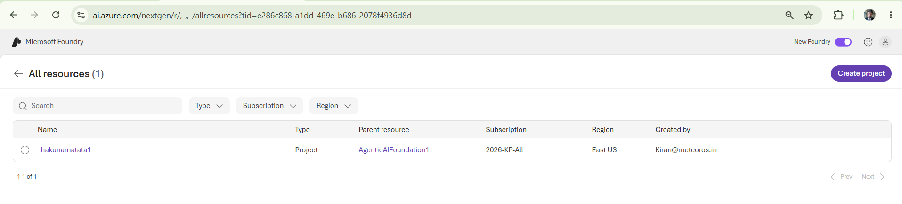
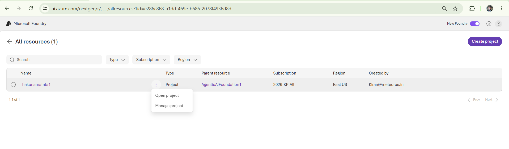
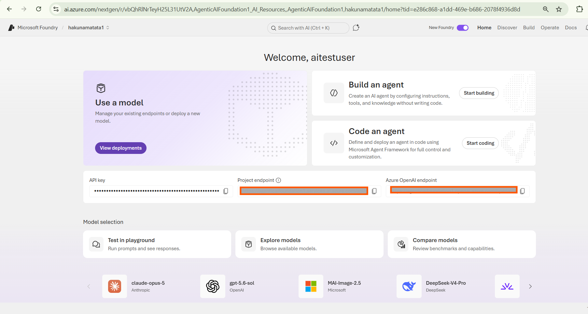
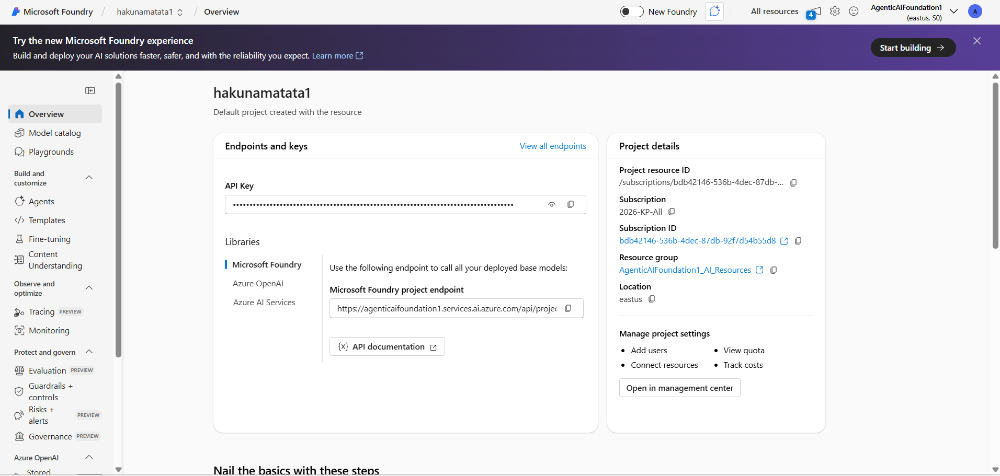
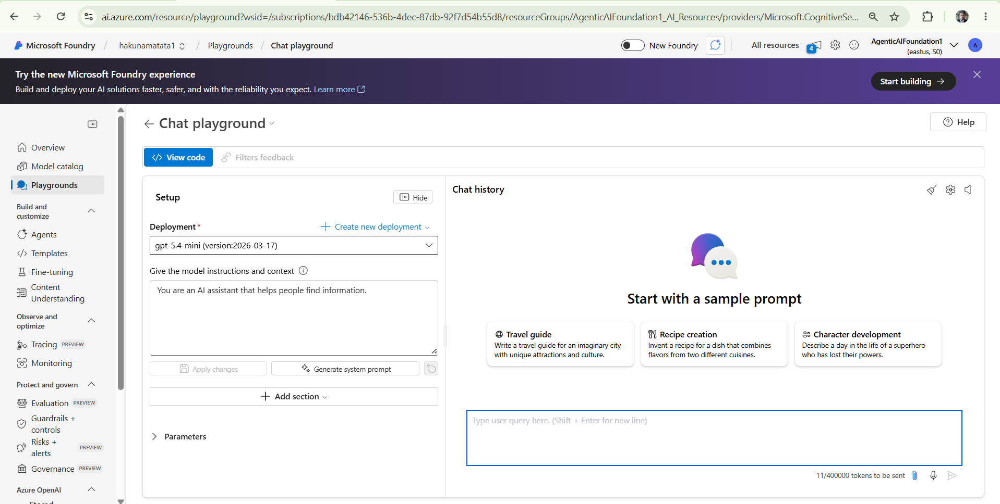
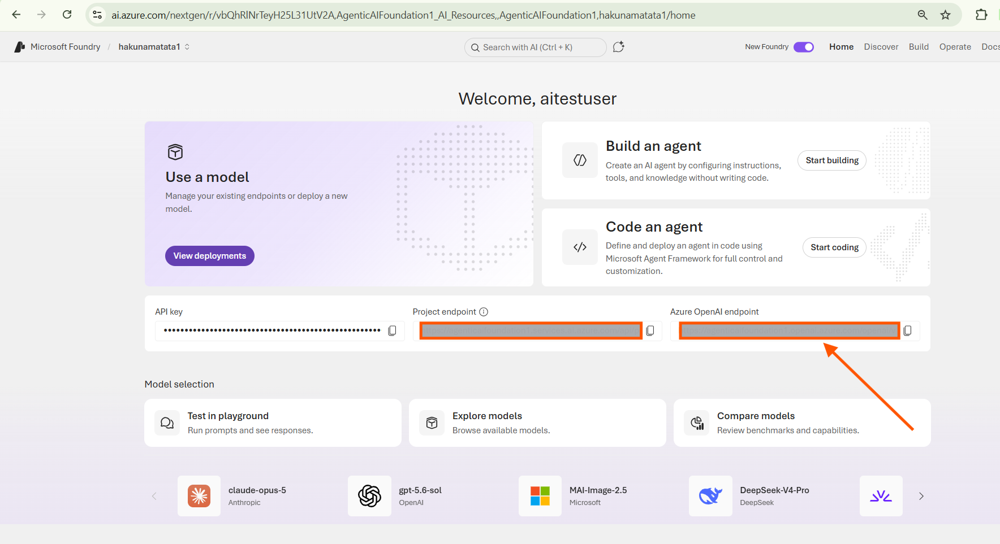
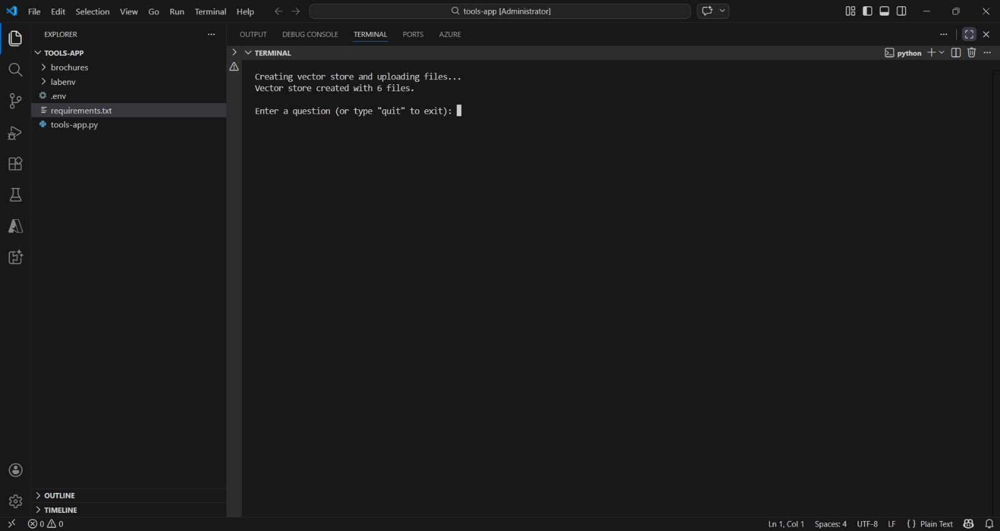
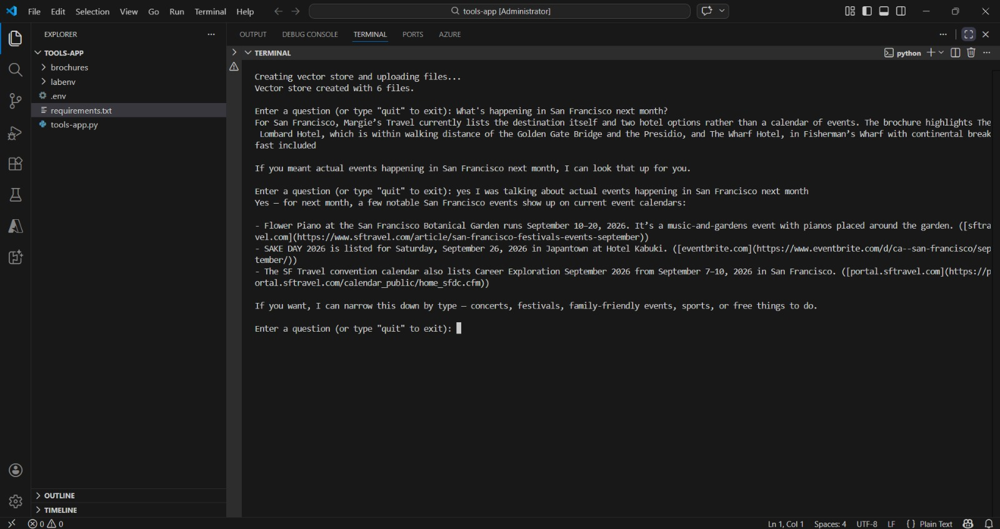
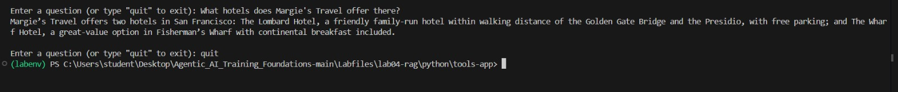

---
lab:
  title: Create a generative AI app that uses tools
  description: Learn how to use tools to extend the capabilities of a model.
  level: 300
  duration: 30
  islab: true
  status: 'released't
---

# Create a generative AI app that uses tools
1.Before we start this exercise, let's download Azure CLI: Install Azure CLI using the link-  https://aka.ms/installazurecliwindows (browse this URL in any browser), and after downloading, install it.
In this exercise, you'll use the Microsoft Foundry portal and the Responses API to build an AI chat application. Then you'll integrate knowledge into your application by using the *web_search* and *file_search* tools.

This exercise takes approximately **30** minutes.

> **Note**: Some of the technologies used in this exercise are in preview or in active development. You may experience some unexpected behavior, warnings, or errors.

## Prerequisites

Before starting this exercise, ensure you have:

- An active [Azure subscription](https://azure.microsoft.com/pricing/purchase-options/azure-account)
- [Visual Studio Code](https://code.visualstudio.com/) installed
- [Python version **3.13.xx**](https://www.python.org/downloads/release/python-31312/) installed\*
- [Azure CLI](https://learn.microsoft.com/cli/azure/install-azure-cli?view=azure-cli-latest) installed

> \* Python 3.14 is available, but some dependencies are not yet compiled for that release. The lab has been successfully tested with Python 3.13.12.

# Verify the created Microsoft Foundry project

Microsoft Foundry uses projects to organize models, resources, data, and other assets used to develop an AI solution.

1. In a web browser, open the [Microsoft Foundry portal](https://ai.azure.com) at `https://ai.azure.com` to start building; signing in using your Azure credentials. Close any tips or quick start panes that are opened the first time you sign in.

2. Locate the project that is already created with the name **hakunamatata1**. Select the **New Foundry** toggle in the top banner to switch to the new Foundry interface (you can switch back to the classic interface later using the same toggle).

    

3. Hover over the **hakunamatata1** project card. A three-dot menu icon will appear — select it to reveal two options: **Open project** and **Manage project**. Select **Open project**.

    

4. Selecting **Open project** redirects you to the project's Home page, where you'll see the **Welcome** screen with options to **Use a model**, **Build an agent**, and **Code an agent**, along with your **API key**, **Project endpoint**, and **Azure OpenAI endpoint** fields. Below that, you'll find the **Model selection** section and a list of your **Recent work** (agents and models).

    

5. Select the **New Foundry** toggle in the top banner again to switch back to the classic Foundry interface.

    

## Verify the deployed model

Next, let's verify the deployed model that you'll use in your chat application.


1. Once the Microsoft Foundry project is open, locate **Playgrounds** in the left panel and double-click it. You'll see the **Chat Playground** option — select the **Try the Chat Playground** button. Verify that the **gpt-5.4-mini** model is auto-selected.

    

## Experiment with tools in the playground

Before developing a chat application, let's explore how the model responds in the playground. This will help you understand why grounding data matters.

1. After deploying your model, you should be in the playground with that model selected. If not, select **Build** in the top menu bar, then select **Deployments** on the left, and then select the model you deployed.
1. In the chat playground, in the pane on the left, ensure that the deployed GPT model is selected

1. In the **Instructions** field, enter the following prompt and then select **Apply Changes**:

    ```
   You are a travel assistant that provides information on travel services available from Margie's Travel.
    ```

1. In the chat pane, enter the query `What are some recommended tourist activities in New York next month?` and review the response.

    The response should be fairly generic — the model provides general knowledge based on its training data, but doesn't have access to current information about what's happening in New York next month.

1. **(Optional)** If the **Tools** section is available in the pane on the left under the instructions, select **Add** and add the **web_search** tool.

    > **Note**: Tool availability depends on your Foundry environment, subscription tier, and interface (classic vs. new). If you don't see a **Tools** section, or `web_search` isn't listed, skip this step — it may not be enabled for your setup.

1. If you were able to add the tool, enter the same query `What are some recommended tourist activities in New York next month?` again in the chat pane and review the response.

    If the tool was added, the model should now use *web_search* to retrieve current information about activities in New York, instead of relying only on its training data.

## Create an app that uses tools

Now that you've seen how tools can extend a model's capabilities in the playground, let's build a client application that uses tools to provide travel advice for Margie's Travel customers.

# Get the endpoint

You'll need an endpoint to connect to the model from a client application. In this exercise, we're going to use the OpenAI SDK to chat with the model, and we'll use the Azure OpenAI endpoint with Entra ID authentication to connect to it.

> **Note**: As an alternative to Entra ID authentication, you could use the API key for the project. Using Entra ID authentication is preferred whenever possible.

1. On the menu bar, select the **Home** page.

1. Note the **Azure OpenAI Endpoint** displayed there.

    

    > **Tip**: You'll use the **Azure OpenAI Endpoint** in this exercise, <u>not</u> the project endpoint! You can find this endpoint directly on the [Microsoft Foundry](https://ai.azure.com) project Home page, listed alongside the **API key** and **Project endpoint** fields.

### Get the application files from GitHub

The initial application files you'll need to develop your chat application are provided in a GitHub repo.

1. In a browser like Microsoft Edge, browse the URL: https://github.com/Kiran-255666/agentic-ai-azure-ai-foundry-labs.git and download the repository into your VM.
2. The Repository will get download in Downloads folder, right click the file and select Extract all to unzip the zip file.
3. In Visual Studio Code, click on File menu, then select open Folder.
4. Select the folder that you have unzipped in the previous step.
5. You may be prompted to confirm you trust the authors. Click on **yes, I trust the authors.**

### Prepare the application configuration

1. In Visual Studio Code, view the **Extensions** pane; and if it is not already installed, install the **Python** extension.
1. In the **Command Palette**, use the command `python:select interpreter`. Then select an existing environment if you have one, or create a new **Venv** environment based on your Python 3.1x installation.

    > **Tip**: If you are prompted to install dependencies, you can install the ones in the *requirements.txt* file in the */labfiles/tools/python/tools-app* folder; but it's OK if you don't - we'll install them later!

1. In the Explorer pane, navigate to the folder containing the application code files at **Day-04/Lab-01-use-own-data-Rag/python/tools-app**. The application files include:
    - **brochures** (a folder containing Margie's Travel brochures)
    - **.env** (the application configuration file)
    - **requirements.txt** (the Python package dependencies that need to be installed)
    - **tools-app.py** (the code file for the application)

1. In the **Explorer** pane, right-click the **tools-app** folder containing the application files, and select **Open in integrated terminal** (or open a terminal in the **Terminal** menu and navigate to the *lab04-rag/python/tools-app* folder.)

    > **Note**: Opening the terminal in Visual Studio Code will automatically activate the Python environment. You may need to enable running scripts on your system.

1. Ensure that the terminal is open in the **Day-04/Lab-01-use-own-data-Rag/python/tools-appp** folder with the prefix **(.venv)** to indicate that the Python environment you created is active.

    ```powershell
    python -m venv .venv
    .venv\Scripts\Activate.ps1
    ```

    > **Tip**: If PowerShell blocks the activation script with an execution policy error, run `Set-ExecutionPolicy -Scope Process -ExecutionPolicy Bypass` first, then retry the activation command.

1. Install the OpenAI SDK, Azure identity, and other required packages by running the following command:

    ```
    pip install -r requirements.txt
    ```

1. In the **Explorer** pane, in the **Day-04/Lab-01-use-own-data-Rag/python/tools-app** folder, select the **.env** file to open it. Then update the configuration values to include the **Azure OpenAI Endpoint** and the name assigned to the deployment for the **gpt-5.2** model.

    > **Tip**: Copy the **Azure OpenAI Endpoint** (not the project endpoint!) from the project home page in the Foundry portal, and enter the exact deployment name assigned to your deployment in the `MODEL_DEPLOYMENT` setting.

    Save the modified configuration file.

### Write code to implement chat with tools (We have already updated the mentioned files with the code mentioned in the instruction, but we would highly suggest going through it before executing it)

1. In the **Explorer** pane, in the **Day-04/Lab-01-use-own-data-Rag/python/tools-app** folder, select the **tools-app.py** file to open it.
1. Review the existing code. You will add code to use the OpenAI SDK to access your model.

    > **Tip**: As you add code to the code file, be sure to maintain the correct indentation.

1. At the top of the code file, under the existing namespace references, find the comment **Import namespaces** and add the following code to import the namespace you will need to use the OpenAI SDK:

    ```python
   # import namespaces
   from openai import OpenAI
   from azure.identity import DefaultAzureCredential, get_bearer_token_provider
    ```

1. In the **main** function, note that code to load the endpoint and key from the configuration file has already been provided. Then find the comment **Initialize the OpenAI client**, and add the following code to create a client for the OpenAI API:

    ```python
   # Initialize the OpenAI client
   token_provider = get_bearer_token_provider(
        DefaultAzureCredential(), "https://ai.azure.com/.default"
   )
    
   openai_client = OpenAI(
        base_url=azure_openai_endpoint,
        api_key=token_provider
   )
    ```

1. In the **main** function, find the comment **Create vector store and upload files**, and add the following code:

    ```python
   # Create vector store and upload files
   print("Creating vector store and uploading files...")
   vector_store = openai_client.vector_stores.create(
        name="travel-brochures"
   )
   file_streams = [open(f, "rb") for f in glob.glob("brochures/*.pdf")]
   if not file_streams:
        print("No PDF files found in the brochures folder!")
        return
   file_batch = openai_client.vector_stores.file_batches.upload_and_poll(
        vector_store_id=vector_store.id,
        files=file_streams
   )
   for f in file_streams:
        f.close()
   print(f"Vector store created with {file_batch.file_counts.completed} files.")
    ```

    This code creates a vector store for your model, and uploads the brochures to it. We'll use this vector store with the *file_search* tool.

1. In the **main** function, note that code to request a user prompt until the user quits the app has been provided. Within this loop, find the **Get a response using tools** comment, and add the following code:

    ```python
   # Get a response using tools
   response = openai_client.responses.create(
        model=model_deployment,
        instructions="""
        You are a travel assistant that provides information on travel services available from Margie's Travel.
        Answer questions about services offered by Margie's Travel using the provided travel brochures.
        Search the web for general information about destinations or current travel advice.
        """,
        input=input_text,
        previous_response_id=last_response_id,
        tools=[
            {
                "type": "file_search",
                "vector_store_ids": [vector_store.id]
            },
            {
                "type": "web_search"
            }
        ]
   )
   print(response.output_text)
   last_response_id = response.id
    ```

    This code submits a prompt and specifies that the *file_search* tool can be used to search the vector store and the *web_search* tool can be used or general web searches.

1. Save the changes to the code file.

1. In the terminal, check if you're already signed in to Azure:

    ```powershell
    az account show
    ```

    - If this shows your account details, skip to the next exercise — you're already signed in.
    - If it shows an error (nothing found), sign in with:

    ```powershell
    az login
    ```

    > **Note**: If you have subscriptions in multiple tenants, add `--tenant <tenant-id>`. See [Sign into Azure interactively using the Azure CLI](https://learn.microsoft.com/cli/azure/authenticate-azure-cli-interactively) for details.

1. When prompted, follow the instructions to sign into Azure. Then complete the sign in process in the command line, viewing (and confirming if necessary) the details of the subscription containing your Foundry resource.

1. After you have signed in, enter the following command to run the application:

    ```powershell
    python tools-app.py
    ```

    The program should run in the terminal (if not, resolve any errors and try again).

    

1. When prompted with `Enter a question (or type "quit" to exit):`, ask `What's happening in San Francisco next month?` and review the response from your generative AI model.

    > **Tip**: The model may first respond with hotel/travel info from *file_search* instead of actual events, since the question is a bit ambiguous. If that happens, follow up with a more specific question such as `What actual events are happening in San Francisco next month?` to get a response from the *web_search* tool.

    The response should include information retrieved using the *web_search* tool.

    

1. Try this follow-up question: `What hotels does Margie's Travel offer there?`

    The response should include information retrieved using the *file_search* tool.

    

1. When you're done, type `quit` to exit the application.
