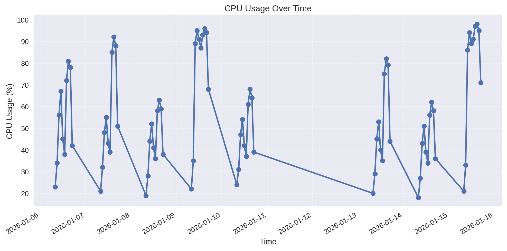

---
lab:
    title: 'Build AI agents with portal and VS Code'
    description: 'Create an AI agent using both Microsoft Foundry portal and the Foundry Toolkit VS Code extension with built-in tools like file search and code interpreter.'
    level: 300
    duration: 45
    islab: true
    status: 'released'
---

# Build AI agents with portal

In this exercise, you'll build an AI agent solution using a Microsoft Foundry project that has already been deployed and prepared for the lab. You'll create and configure an agent in the Foundry portal, then interact with it from Visual Studio Code by using the Foundry Toolkit extension and a Python client application.

This exercise takes approximately **45** minutes.

> **Note**: Some of the technologies used in this exercise are in preview or active development. You may experience unexpected behavior, warnings, or errors.

## Prerequisites

Before starting this exercise, ensure you have:

- Access to the Microsoft Foundry project prepared by your trainer or lab environment
- Permission to create and configure agents in that project
- [Visual Studio Code](https://code.visualstudio.com/) installed on your local machine
- [Python 3.13](https://www.python.org/downloads/) or later installed
- [Git](https://git-scm.com/downloads) installed on your local machine
- Basic familiarity with Azure AI services and Python programming
- Install Azure CLI using the link- https://aka.ms/installazurecliwindows

> **Important**: The Microsoft Foundry project, resource, region, subscription, and deployed model are already provided for this lab. Do **not** create a new Foundry resource or project.

> Python 3.13 is available, but some dependencies may not yet be compiled for that release. The lab has been successfully tested with Python 3.13.12.

## Open the existing Microsoft Foundry project

Microsoft Foundry projects organize models, resources, data, and other assets used to develop an AI solution. For this lab, use the existing project prepared by your trainer or lab environment. Do **not** create a new project, Foundry resource, or model deployment.

1. Open the [Microsoft Foundry portal](https://ai.azure.com) at `https://ai.azure.com` and sign in using your Azure credentials. Close any tips or quick-start panes that appear.

1. On the project home page, select **Start building** in the **Build an agent** card.

    

1. If Foundry displays the **All resources** page, select the existing project provided for this lab. In this example, the project is named `hakunamatata1`.

    

1. In the **Create an agent** dialog, enter `it-support-agent` as the **Agent name**.

1. Select **Create**.

    

The agent playground opens. An available deployed model should already be selected for you.

    

> **Important**: The existing project already contains the required resources and deployed model. Continue by configuring the agent; do not select **Create project**, deploy another model, or change the project resource settings.

## Configure your agent with instructions and grounding data

Now configure the agent with instructions, File search, and Code interpreter.

1. In the agent playground, set **Instructions** to:

    ```prompt
    You are an IT Support Agent for Contoso Corporation.
    You help employees with technical issues and IT policy questions.

    Guidelines:
    - Always be professional and helpful
    - Use the IT policy documentation to answer questions accurately
    - If you don't know the answer, admit it and suggest contacting IT support directly
    - When creating tickets, collect all necessary information before proceeding
    ```

    

1. Download the IT policy document from the lab repository:

    ```text
    https://github.com/Kiran-255666/agentic-ai-azure-ai-foundry-labs/blob/main/labfiles/Day-04/Lab-03-build-agent-portal-and-vscode/IT_Policy.txt
    ```

    Save the file locally as `IT_Policy.txt`.

    > **Note**: This document contains sample policies for password resets, software installation requests, and hardware troubleshooting.

1. Return to the agent playground. In the **Tools** section, select **Add**. You will get a dropdown; under Most Popular, you can find **Code interpreter**. Toggle the switch from off to on. If it is not found, select **Add** again, then click on **Add tools**. You can then choose **Code interpreter** from the displayed options and click on **Add tool**.

    

1. In the **Tools** section, select **Add**. You will get a dropdown; then click on **Add tools**. You can then choose **File search** from the displayed options and click on **Add tool**.

    

1. After adding the tool, you will be redirected to a page where you can see **Drag and drop files here or browse for files**. You can either drag and drop the `IT_Policy.txt` file or browse your local files and upload it. If you have not downloaded the file earlier, you can download it from [GitHub](https://github.com/Kiran-255666/agentic-ai-azure-ai-foundry-labs/blob/main/labfiles/Day-04/Lab-03-build-agent-portal-and-vscode/IT_Policy.txt). After attaching the file, you will see the Status as **Success**. Then, select **Attach**.

1. Wait for the file to be indexed.
1. Download the system performance data file:

    ```text
    https://github.com/Kiran-255666/agentic-ai-azure-ai-foundry-labs/blob/main/labfiles/Day-04/Lab-03-build-agent-portal-and-vscode/system_performance.csv
    ```

    Save the file locally as `system_performance.csv`.

1. To the right of **</> Code interpreter**, select **+ Files**, then upload `system_performance.csv` by either drag and drop the `system_performance.csv` file or browse your local files and upload it.After attaching the file, you will see the Status as **Success**. Then, select **Attach**.

    > **Note**: This CSV file contains simulated CPU, memory, and disk metrics over time.

1. Save the agent.

## Test your agent

Test the agent to confirm that it uses the grounding data and code interpreter.

1. In the playground chat pane, enter:

    ```text
    What's the policy for password resets?
    ```

1. Review the response. The agent should use the IT policy document.

    

1. Enter:

    ```text
    How do I request new software?
    ```

1. Review the response and observe how the agent uses the uploaded policy data.

    

1. Test Code interpreter by entering:

    ```text
    Can you analyze the system performance data and tell me if there are any concerning trends?
    ```

    

1. Request a visualization:

    ```text
    Create a chart showing CPU usage over time from the performance data
    ```

    

The agent should use **Code interpreter** to analyze the CSV performance data, process the CPU usage values, and generate a visualization showing CPU usage over time. The visualization may be generated successfully, but in some cases, you may not be able to download the generated file from the agent playground. If this happens, you can copy the code generated by the agent and run it in **VS Code**, **Jupyter Notebook**, or **Google Colab** using the same CSV data. This should reproduce the visualization and allow you to view it successfully.
    


## Summary

You used an existing Microsoft Foundry project and its deployed model to create an IT support agent. You grounded it with IT policy data, enabled File search and Code interpreter, tested it in the portl.
