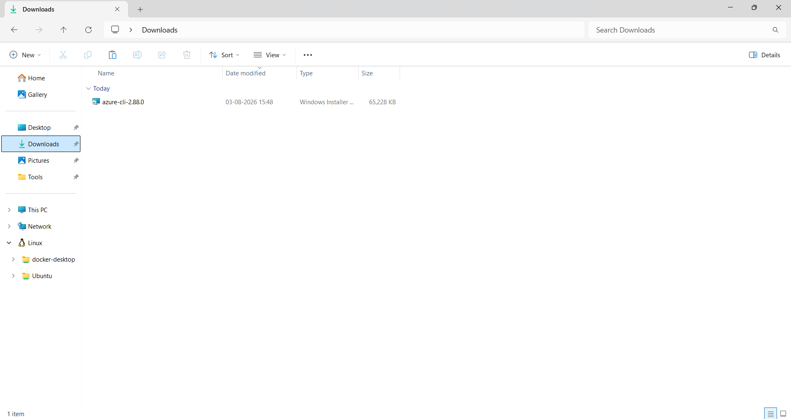
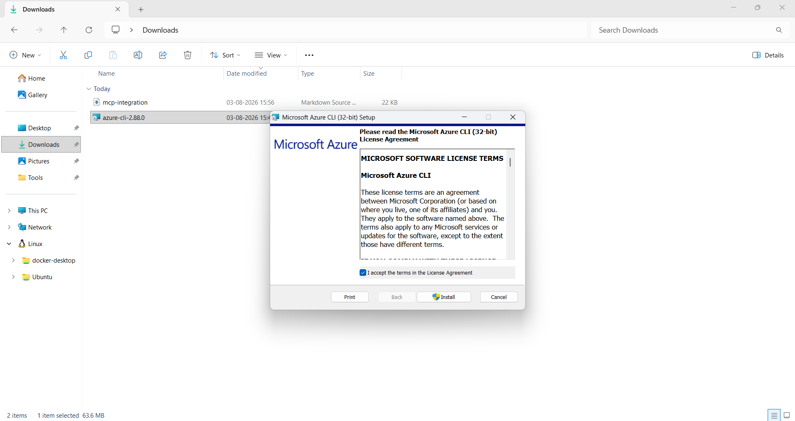
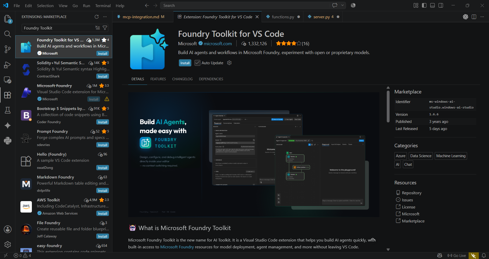
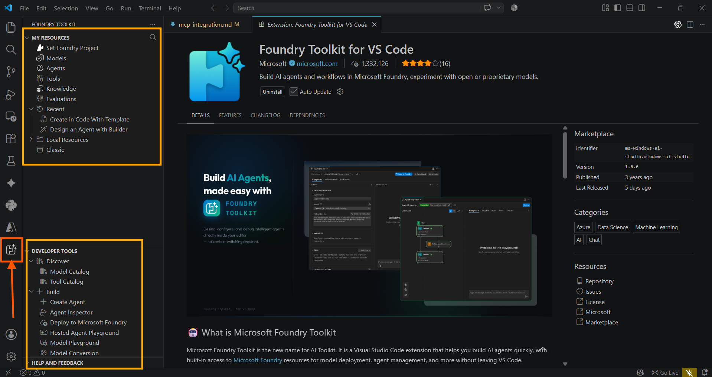
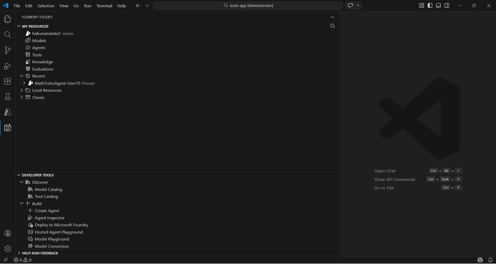
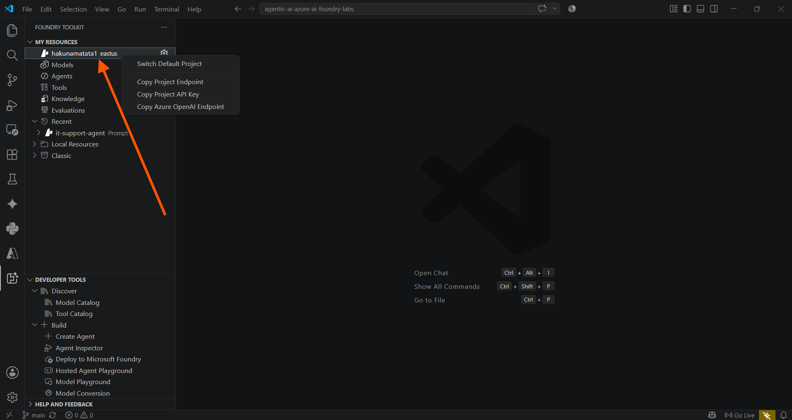

---
lab:
    title: 'Develop a multi-agent solution with Microsoft Agent Framework'
    description: 'Learn to configure multiple agents to collaborate using the Microsoft Agent Framework SDK'
    level: 300
    duration: 30
    islab: true
    status: 'released'
---

# Develop a multi-agent solution with Microsoft Agent Framework

In this exercise, you'll practice using the sequential orchestration pattern in the Microsoft Agent Framework SDK. You'll create a simple pipeline of three agents that work together to process customer feedback and suggest next steps. You'll create the following agents:

- The Summarizer agent will condense raw feedback into a short, neutral sentence.
- The Classifier agent will categorize the feedback as Positive, Negative, or a Feature request.
- Finally, the Recommended Action agent will recommend an appropriate follow-up step.

You'll learn how to use the Microsoft Agent Framework SDK to break down a problem, route it through the right agents, and produce actionable results. Let's get started!

This exercise should take approximately **30** minutes to complete.

> **Note**: Some of the technologies used in this exercise are in preview or in active development. You may experience some unexpected behavior, warnings, or errors.

## Prerequisites

Before starting this exercise, ensure you have:

- [Visual Studio Code](https://code.visualstudio.com/) installed on your local machine
- An active [Azure subscription](https://azure.microsoft.com/free/)
- [Python 3.13](https://www.python.org/downloads/) or later installed

> \* Python 3.13 is available, but some dependencies are not yet compiled for that release. The lab has been successfully tested with Python 3.13.12.

## Access your Foundry project with the Foundry Toolkit for VS Code extension

> **Note**: If the Foundry Toolkit extension is already installed and you have a default Foundry project active from a previous lab, skip this section and go straight to [Use the deployed model](#use-the-deployed-model).

Before you can work with agents, you need a way to reach your Foundry project resources from inside VS Code. The Foundry Toolkit extension gives you that connection, but it depends on the Azure CLI being installed first, so let's set both up in order.

1. Install Azure CLI using the following link: [https://aka.ms/installazurecliwindows](https://aka.ms/installazurecliwindows). Click the link to download the installer. The download will start automatically and the installer will be available in your **Downloads** folder. If the download does not start automatically, copy and paste the link into your browser.

    

2. After the download is complete, run the installer and follow the installation steps.

    

With Azure CLI installed, you're ready to connect Visual Studio Code to your Foundry resources. As a developer, you may spend time working in the Microsoft Foundry portal, but most development tasks are typically performed in Visual Studio Code. The Foundry Toolkit extension enables you to work with Foundry project resources directly within Visual Studio Code, allowing you to stay within your development environment.

1. Open Visual Studio Code.

2. Select **Extensions** from the left pane (or press **Ctrl+Shift+X**).

3. Search the Extensions Marketplace for the **Foundry Toolkit** extension from Microsoft and select **Install**.

    > **Note**: The extension is currently listed as **Foundry Toolkit for VS Code**, but some VS Code labels, commands, or older screenshots may still refer to **AI Toolkit**. In this lab, treat those names as referring to the same extension experience. Below is a snippet of the new version, which is the official **Foundry Toolkit for VS Code** extension published by Microsoft.

    

4. After installing the extension, select its icon in the sidebar to open the Foundry Toolkit view.

    You'll initially see the default **My Resources** and **Developer Tools** sections in the panel, but they won't be populated with your actual project data. To use the extension's full functionality and complete this lab, you need to sign in to your Azure account.

    

5. Open the integrated terminal (**Ctrl+Shift+`**) and run the following command to sign in to Azure:

    ```powershell
    az login
    ```

    A browser window will open automatically, asking you to sign in. Select the email address provided by your trainer, then select **Continue**.

    Back in the terminal, you'll see a prompt similar to:

    ```
    Select a subscription and tenant (Type a number or Enter for no changes):
    ```

    Type **1** and press **Enter** to select the default subscription (or the one provided by your trainer). You'll then see confirmation that the default subscription has been set, along with your account details.

    > **Note**: Sometimes you might additionally be prompted to sign in to Azure below this step too — if so, complete that sign-in the same way, using the same assigned account. You might be prompted to authenticate more than once during the setup process. If prompted, use the same assigned account to complete each authentication request.

    If the sign-in completes without any issues, skip ahead to step 8. If you see an error saying the `az` command isn't recognized, go to step 6. If the sign-in window closes or gets cancelled partway through, go to step 7.

6. If the `az` command isn't recognized (e.g., `'az' is not recognized as a name of a cmdlet, function, script file, or executable program`), Azure CLI likely isn't installed correctly, or the terminal session started before the installation finished updating your PATH.

    > **Troubleshooting**: To fix this:
    > 1. Close and reopen the integrated terminal (or restart VS Code entirely), then try `az login` again.
    > 2. If the error persists, uninstall and reinstall Azure CLI using the following commands:
    >    ```powershell
    >    winget uninstall Microsoft.AzureCLI
    >    winget install Microsoft.AzureCLI
    >    ```
    > 3. Restart the terminal after installation completes, then run `az login` again.

7. If the sign-in window is closed accidentally or cancelled (you may see `User cancelled the Accounts Control Operation`), run the following commands to reset the session and try again:

    ```powershell
    az logout
    az login
    ```

8. Verify that a default project is already active. The project name will appear under **My Resources**.

    > **Tip**: To switch to a different project, select **Models** in the left panel under **My Resources**. You'll see two options: **Switch Project** and **Create Project**. Select **Switch Project** to change your default Azure Resources project.

    

With Azure CLI installed, the Foundry Toolkit signed in, and a default project active, VS Code is now connected to your Foundry resources — including the model that's already deployed in that project. The next step is to point your agent code at that deployment.

## Use the deployed model

Use the deployed model that's already available in your Foundry project. Right-click the name of the project deployment and select **Copy Project Endpoint**. You'll need this URL to connect your agent to the Foundry project in the next steps.



## Download the starter code repository

For this exercise, you'll use starter code that will help you connect to your Foundry project and create a multi-agent solution that can process customer feedback.

> **Note**: If you've already downloaded and extracted the repository in a previous lab, skip ahead to step 5 below.

1. In a browser like Microsoft Edge, browse to [https://github.com/Kiran-255666/agentic-ai-azure-ai-foundry-labs](https://github.com/Kiran-255666/agentic-ai-azure-ai-foundry-labs) and download the repository as a ZIP file into your VM.
2. The repository will download to your Downloads folder. Right-click the file and select **Extract All** to unzip the file.
3. In VS Code, click on the **File** menu, then select **Open Folder**.
4. Select the folder that you unzipped in the previous step.
5. Once the repository opens, select **File > Open Folder** and navigate to `agentic-ai-azure-ai-foundry-labs\labfiles\Day-05\Lab-02-integrate-agent-with-foundry-iq\python`, then choose **Select Folder**.
6. In the Explorer pane, view the code files for this exercise.
7. Right-click on the **requirements.txt** file and select **Open in Integrated Terminal**.
8. In the terminal, enter the following command to install the required Python packages in a virtual environment:

    ```
    python -m venv labenv
    .\labenv\Scripts\Activate.ps1
    pip install -r requirements.txt
    ```

9. Open the **.env** file, replace the **your_project_endpoint** placeholder with the endpoint for your project (copied from the project deployment resource in the Foundry Toolkit extension) and ensure that the MODEL_DEPLOYMENT_NAME variable is set to your deployed model's name. Use **Ctrl+S** to save the file after making these changes.

## Create AI agents (Note: We have the code updated in the mentioned files instructions but verify before you start the execution, so that there are no indentation issues)

Now you're ready to create the agents for your multi-agent solution! Let's get started!

1. Open the **agents.py** file in the code editor.

1. At the top of the file under the comment **Add references**, and add the following code to reference the namespaces in the libraries you'll need to implement your agent:

    ```python
   # Add references
   from agent_framework import Message
   from agent_framework.foundry import FoundryChatClient
   from agent_framework.orchestrations import SequentialBuilder
   from azure.identity import AzureCliCredential
    ```

1. In the **main** function, take a moment to review the agent instructions. These instructions define the behavior of each agent in the orchestration.

1. Add the following code under the comment **Create the chat client**:

    ```python
   # Create the chat client
   credential = AzureCliCredential()
   chat_client = FoundryChatClient(
       credential=credential,
       project_endpoint=os.getenv("AZURE_AI_PROJECT_ENDPOINT"),
       model=os.getenv("AZURE_AI_MODEL_DEPLOYMENT_NAME"),
   )
    ```

    Note that the **AzureCliCredential** object will allow your code to authenticate to your Azure account. The **FoundryChatClient** object connects to your Foundry project using the endpoint and model deployment name from the .env configuration.

1. Add the following code under the comment **Create agents**:

    (Be sure to maintain the indentation level)

    ```python
   # Create agents
   summarizer_agent = chat_client.as_agent(
       name="summarizer",
       instructions=summarizer_instructions,
   )

   classifier_agent = chat_client.as_agent(
       name="classifier",
       instructions=classifier_instructions,
   )

   action_agent = chat_client.as_agent(
       name="action",
       instructions=action_instructions,
   )
    ```

## Create a sequential orchestration (Note: We have the code updated in the mentioned files instructions but verify before you start the execution, so that there are no indentation issues)

1. In the **main** function, find the comment **Initialize the current feedback** and add the following code:

    (Be sure to maintain the indentation level)

    ```python
   # Initialize the current feedback
   feedback="""
   I use the dashboard every day to monitor metrics, and it works well overall. 
   But when I'm working late at night, the bright screen is really harsh on my eyes. 
   If you added a dark mode option, it would make the experience much more comfortable.
   """
    ```

1. Under the comment **Build a sequential orchestration**, add the following code to define a sequential orchestration with the agents you defined:

    ```python
   # Build sequential orchestration
   workflow = SequentialBuilder(
       participants=[summarizer_agent, classifier_agent, action_agent],
       output_from="all",
   ).build()
    ```

    The agents will process the feedback in the order they are added to the orchestration. The `output_from="all"` parameter ensures that outputs from all agents are collected.

1. Add the following code under the comment **Run and collect outputs**:

    ```python
   # Run and collect outputs
   result = await workflow.run(f"Customer feedback: {feedback}")
   outputs = result.get_outputs()
    ```

    This code runs the orchestration and collects the output from each of the participating agents.

1. Add the following code under the comment **Display outputs**:

    ```python
   # Display outputs
   i = 1
   for response in outputs:
       for msg in cast(list[Message], response.messages):
           name = msg.author_name or ("assistant" if msg.role == "assistant" else "user")
           print(f"{'-' * 60}\n{i:02d} [{name}]\n{msg.text}")
           i += 1
    ```

    This code formats and displays the messages from the workflow outputs you collected from the orchestration.

1. Use the **CTRL+S** command to save your changes to the code file.

## Test the application

Now you're ready to run your code and watch your AI agents collaborate.

1. In the integrated terminal, enter the following commands to run the application:

    ```
    az login
    ```

    ```
   python agents.py
    ```

1. You should see some output similar to the following:

    ```output
    User requests a dark mode option for more comfortable nighttime use.
    Feature request
    Log as enhancement request to add dark mode for improved user comfort during nighttime use.
    ------------------------------------------------------------
    01 [summarizer]
    User requests a dark mode option for more comfortable nighttime use.
    ------------------------------------------------------------
    02 [classifier]
    Feature request
    ------------------------------------------------------------
    03 [action]
    Log as enhancement request to add dark mode for improved user comfort during nighttime use.
    ```

1. Optionally, you can try running the code using different feedback inputs, such as:

    ```output
    I reached out to your customer support yesterday because I couldn't access my account. The representative responded almost immediately, was polite and professional, and fixed the issue within minutes. Honestly, it was one of the best support experiences I've ever had.
    ```

1. When you're finished, enter `deactivate` in the terminal to exit the Python virtual environment.