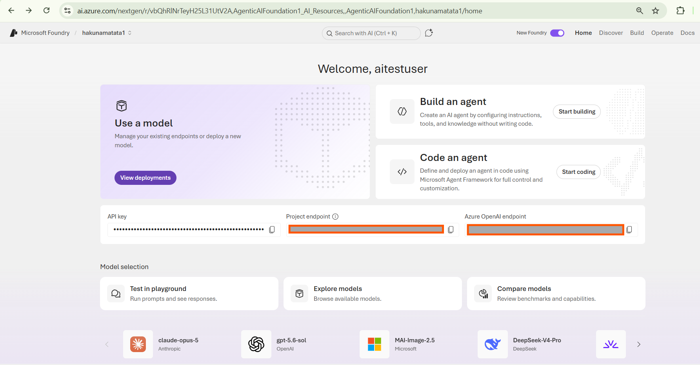

---
lab:
    title: 'Extend agents with Model Context Protocol (MCP) tools'
    description: 'Extend agent capabilities by integrating Model Context Protocol (MCP) server tools.'
    level: 300
    duration: 60
    islab: true
    status: 'released'
---

# Extend agents with Model Context Protocol (MCP) tools

In this exercise, you'll use the Foundry Toolkit for VS Code extension to create an agent that can use Model Context Protocol (MCP) server tools to access external data sources and APIs. The agent will be able to retrieve up-to-date information and interact with custom services through MCP tools.

This exercise should take approximately **60** minutes to complete.

> **Note**: Some of the technologies used in this exercise are in preview or in active development. You may experience some unexpected behavior, warnings, or errors.

## Prerequisites

Before starting this exercise, ensure you have:

- [Visual Studio Code](https://code.visualstudio.com/) installed on your local machine
- An active [Azure subscription](https://azure.microsoft.com/free/)
- [Python 3.13](https://www.python.org/downloads/) or later installed
- Install Azure CLI using the link- https://aka.ms/installazurecliwindows


> \* Python 3.13 is available, but some dependencies are not yet compiled for that release. The lab has been successfully tested with Python 3.12.

## Access your Foundry project with the Foundry Toolkit for VS Code extension 

1. Before starting the lab, install Azure CLI using the following link: [https://aka.ms/installazurecliwindows](https://aka.ms/installazurecliwindows). Click the link to download the installer. The download will start automatically and the installer will be available in your **Downloads** folder. If the download does not start automatically, copy and paste the link into your browser.

    

2. After the download is complete, run the installer and follow the installation steps.

    

As a developer, you may spend time working in the Microsoft Foundry portal, but most development tasks are typically performed in Visual Studio Code. The Foundry Toolkit extension enables you to work with Foundry project resources directly within Visual Studio Code, allowing you to stay within your development environment.

1. Open Visual Studio Code.

2. Select **Extensions** from the left pane (or press **Ctrl+Shift+X**).

3. Search the Extensions Marketplace for the **Foundry Toolkit** extension from Microsoft and select **Install**.

    > **Note**: The extension is currently listed as **Foundry Toolkit for VS Code**, but some VS Code labels, commands, or older screenshots may still refer to **AI Toolkit**. In this lab, treat those names as referring to the same extension experience. Below is a snippet of the new version, which is the official **Foundry Toolkit for VS Code** extension published by Microsoft.

    

4. After installing the extension, select its icon in the sidebar to open the Foundry Toolkit view.

    You'll initially see the default **My Resources** and **Developer Tools** sections in the panel, but they won't be populated with your actual project data. To use the extension's full functionality and complete this lab, you need to sign in to your Azure account.

    

5. Open the integrated terminal (**Ctrl+Shift+`**) and run the following command to sign in to Azure:

    ```powershell
    az login
    ```

    A browser window will open automatically, asking you to sign in. Select the email address provided by your trainer, then select **Continue**.

    Back in the terminal, you'll see a prompt similar to:

    ```
    Select a subscription and tenant (Type a number or Enter for no changes):
    ```

    Type **1** and press **Enter** to select the default subscription (or the one provided by your trainer). You'll then see confirmation that the default subscription has been set, along with your account details.

    > **Note**: Sometimes you might additionally be prompted to sign in to Azure below this step too — if so, complete that sign-in the same way, using the same assigned account. You might be prompted to authenticate more than once during the setup process. If prompted, use the same assigned account to complete each authentication request.

    If the sign-in completes without any issues, skip ahead to step 8. If you see an error saying the `az` command isn't recognized, go to step 6. If the sign-in window closes or gets cancelled partway through, go to step 7.

6. If the `az` command isn't recognized (e.g., `'az' is not recognized as a name of a cmdlet, function, script file, or executable program`), Azure CLI likely isn't installed correctly, or the terminal session started before the installation finished updating your PATH.

    > **Troubleshooting**: To fix this:
    > 1. Close and reopen the integrated terminal (or restart VS Code entirely), then try `az login` again.
    > 2. If the error persists, uninstall and reinstall Azure CLI using the following commands:
    >    ```powershell
    >    winget uninstall Microsoft.AzureCLI
    >    winget install Microsoft.AzureCLI
    >    ```
    > 3. Restart the terminal after installation completes, then run `az login` again.

7. If the sign-in window is closed accidentally or cancelled (you may see `User cancelled the Accounts Control Operation`), run the following commands to reset the session and try again:

    ```powershell
    az logout
    az login
    ```

8. Verify that a default project is already active. The project name will appear under **My Resources**.

    > **Tip**: To switch to a different project, select **Models** in the left panel under **My Resources**. You'll see two options: **Switch Project** and **Create Project**. Select **Switch Project** to change your default Azure Resources project.

    

## Download the starter code repository

For this exercise, you'll use starter code that will help you connect to your Foundry project and create an agent that uses MCP server tools.

1. In a browser like Microsoft Edge, browse the URL: https://github.com/Kiran-255666/Agentic_AI_Training_Foundations.git and download the repository into your VM.
2. The Repository will get download in Downloads folder, right click the file and select Extract all to unzip the zip file.
3. In VS Code, click on File menu, then select open Folder.
4. Select the folder that you have unzipped in the previous step.
5. Once the repository opens, from Visual Studio Code, select **File > Open Folder** and navigate to `Agentic_AI_Training_Foundations/Labfiles/03-mcp-integration`, then choose **Select Folder**.
6. In the Explorer pane, expand the **Python** folder to view the code files for this exercise.
7. Right-click the **requirements.txt** file and select **Open in Integrated Terminal**. Alternatively, press **Ctrl+Shift+`** to open the integrated terminal and navigate to the file location.
8. In the terminal, enter the following command to install the required Python packages in a virtual environment:

    ```
   python -m venv labenv
   .\labenv\Scripts\Activate.ps1
   pip install -r requirements.txt
    ```

1. Open the **.env** file, replace the **your_project_endpoint** placeholder with the endpoint for your project, and ensure that the `MODEL_DEPLOYMENT_NAME` variable is set to your model deployment name. Use **Ctrl+S** to save the file after making these changes.

    > **Tip**: You can find these values in the [Microsoft Foundry portal](https://ai.azure.com). Open your project's **Home** page, and you'll see the **Project endpoint** and **Azure OpenAI endpoint** fields listed alongside your API key. Select the copy icon next to **Project endpoint** to copy it directly into your `.env` file.

    

    > **Security Note**: Never share your API key, endpoints, or `.env` file with anyone, or commit them to a public repository. Treat these values as sensitive credentials at all times.

Now you're ready to create an AI agent that uses MCP server tools to access external data sources and APIs.

## Connect an Azure AI Agent to a remote MCP server (Note: We have the code updated in the mentioned files instructions but verify before you start the execution, so that there are no indentation issues)

In this task, you'll connect to a remote MCP server, prepare the AI agent, and run a user prompt.

1. Open the **agent.py** file in the code editor.

   > **Tip**: As you add code, be sure to maintain the correct indentation. Use the comment indentation levels as a guide.

1. Find the comment **Add references** and add the following code to import the classes:

    ```python
   # Add references
   from azure.identity import AzureCliCredential
   from azure.ai.projects import AIProjectClient
   from azure.ai.projects.models import PromptAgentDefinition, MCPTool
   from openai.types.responses.response_input_param import McpApprovalResponse, ResponseInputParam
    ```

1. Find the comment **Connect to the agents client** and add the following code to connect to the Azure AI project using the current Azure credentials.

    ```python
   # Connect to the agents client
   with (
       AzureCliCredential() as credential,
       AIProjectClient(endpoint=project_endpoint, credential=credential) as project_client,
       project_client.get_openai_client() as openai_client,
   ):
    ```

1. Under the comment **Initialize agent MCP tool**, add the following code:

    ```python
   # Initialize agent MCP tool
   mcp_tool = MCPTool(
       server_label="api-specs",
       server_url="https://learn.microsoft.com/api/mcp",
       require_approval="always",
   )
    ```

    This code will connect to the Microsoft Learn Docs remote MCP server. This is a cloud-hosted service that enables clients to access trusted and up-to-date information directly from Microsoft's official documentation.

1. Under the comment **Create a new agent with the MCP tool** and add the following code:

    ```python
   # Create a new agent with the MCP tool
   agent = project_client.agents.create_version(
       agent_name="MyAgent",
       definition=PromptAgentDefinition(
           model=model_deployment,
           instructions="You are a helpful agent that can use MCP tools to assist users. Use the available MCP tools to answer questions and perform tasks.",
           tools=[mcp_tool],
       ),
   )
   print(f"Agent created (id: {agent.id}, name: {agent.name}, version: {agent.version})")
    ```

    In this code, you provide instructions for the agent and provide it with the MCP tool definitions.

1. Find the comment **Create a conversation thread** and add the following code:

    ```python
   # Create a conversation thread
   conversation = openai_client.conversations.create()
   print(f"Created conversation (id: {conversation.id})")
    ```

1. Find the comment **Send initial request that will trigger the MCP tool** and add the following code:

    ```python
   # Send initial request that will trigger the MCP tool
   response = openai_client.responses.create(
       conversation=conversation.id,
       input="Give me the Azure CLI commands to create an Azure Container App with a managed identity.",
      extra_body={"agent_reference": {"name": agent.name, "type": "agent_reference"}},
   )
    ```

1. Find the comment **Process any MCP approval requests that were generated** and add the following code:

    ```python
   # Process any MCP approval requests that were generated
   # The agent may issue several tool calls, each needing its own approval,
   # so we loop until there are none left.
   while True:
       # Collect any MCP approval requests from the latest response
       input_list: ResponseInputParam = []
       for item in response.output:
           if item.type == "mcp_approval_request":
               if item.server_label == "api-specs" and item.id:
                   # Automatically approve the MCP request to allow the agent to proceed
                   input_list.append(
                       McpApprovalResponse(
                           type="mcp_approval_response",
                           approve=True,
                           approval_request_id=item.id,
                       )
                   )

       # No more approvals needed -> the agent has produced its final response
       if not input_list:
           break

       # Send the approval response back and retrieve the next response
       response = openai_client.responses.create(
           input=input_list,
           previous_response_id=response.id,
           extra_body={"agent_reference": {"name": agent.name, "type": "agent_reference"}},
       )

   print(f"\nAgent response: {response.output_text}")
    ```

    This code listens for any MCP approval requests in the agent's response and automatically approves them.

1. Find the comment **Clean up resources by deleting the agent version** and add the following code:

    ```python
   # Clean up resources by deleting the agent version
   project_client.agents.delete_version(agent_name=agent.name, agent_version=agent.version)
   print("Agent deleted")
    ```

1. Save the code file (*CTRL+S*) when you're finished.

## Test the connection to the remote MCP server

Now you're ready to run the application and see how the agent uses the MCP tool to retrieve information from the Microsoft Learn Docs remote MCP server.

1. Before running the application, verify that you're signed in to Azure by running:

    ```powershell
    az account show
    ```

    If your account details are displayed successfully, proceed to the next step. If you aren't signed in or an error is returned, sign in using:

    ```powershell
    az login
    ```

2. Run the application:

    ```powershell
    python agent.py
    ```

1. Wait for the agent to process the prompt, using the MCP server to find a suitable tool to retrieve the requested information. You should see some output similar to the following:

    ```
   Agent created (id: MyAgent:2, name: MyAgent, version: 2)
   Created conversation (id: conv_086911ecabcbc05700BBHIeNRoPSO5tKPHiXRkgHuStYzy27BS)

   Agent response: Here are Azure CLI commands to create an Azure Container App with a managed identity:

   **1. For a System-assigned Managed Identity**
    ```sh
    az containerapp create \
    --name <CONTAINERAPP_NAME> \
    --resource-group <RESOURCE_GROUP> \
    --environment <CONTAINERAPPS_ENVIRONMENT> \
    --image <CONTAINER_IMAGE> \
    --identity 'system'
    ```

   [continued...]

   Agent deleted

    ```

    Notice that the agent was able to invoke the MCP tool to automatically fulfill the request.

1. You can update the input in the request to ask for different information. In each case, the agent will attempt to find technical documentation by using the MCP tool.

## Create an MCP server with custom tools

In addition to connecting to remote MCP servers, you can also create your own custom MCP server tools and connect them to your agent. A Model Context Protocol (MCP) Server is a component that hosts callable tools. These tools are Python functions that can be exposed to AI agents. When tools are annotated with `@mcp.tool()`, they become discoverable to the client, allowing an AI agent to call them autonomously during a conversation or task. In this task, you'll add tools that will allow an agent to perform inventory inquiries and recommendations.

1. Open the **server.py** file in the code editor.

    In this code file, you'll define the tools the agent can use to simulate a backend service for the retail store. Notice the server setup code at the top of the file. It uses `FastMCP` to quickly spin up an MCP server instance named "Inventory". This server will host the tools you define and make them accessible to the agent during the lab.

1. Under the comment **Add references**, add the following code:

    ```python
   # Add references
   from fastmcp import FastMCP
    ```

1. Under the comment **Create an MCP server**, add the following code to create a new MCP server instance:

    ```python
   # Create an MCP server
   mcp = FastMCP(name="Inventory")
    ```

    This code initializes a new MCP server with the label "Inventory".

1. Find the comment **Add an inventory check mcp tool** and add the following decorator above the function definition, which should now look like this:

    ```python
   # Add an inventory check mcp tool
   @mcp.tool()
   def get_inventory_levels() -> dict:
      # continued...
    ```

    This dictionary represents a sample inventory. The `@mcp.tool()` decorator registers the function as a tool on the MCP server, allowing the LLM to discover your function.

1. Find the comment **Add a weekly sales mcp tool** and add the following decorator above the function definition, which should now look like this:

    ```python
   # Add a weekly sales mcp tool
   @mcp.tool()
   def get_weekly_sales() -> dict:
      # continued...
    ```

1. Find the comment **Run the MCP server** and add the following code to start the server:

    ```python
   # Run the MCP server
   mcp.run(show_banner=False)
    ```

    This code starts the MCP server, making your tools available for discovery and use by the agent. Setting `show_banner=False` prevents the startup banner from being printed to stdout, which would corrupt the MCP stdio protocol.

1. Save the file (*CTRL+S*).

## Implement an MCP client to connect to the custom MCP server (We have already updated the mentioned files with the code mentioned in the instruction, but we would highly suggest going through it before executing it)

An MCP client is the component that connects to the MCP server to discover and call tools. You can think of it as the bridge between the agent and the server-hosted functions, enabling dynamic tool use in response to user prompts.

1. Navigate to the **client.py** file.

1. Find the comment **Add references** and add the following code to import the classes:

    ```python
   # Add references
   from mcp import ClientSession, StdioServerParameters
   from mcp.client.stdio import stdio_client
    ```

1. In the **connect_to_server** method, find the comment **Start the MCP server** and add the following code:

    ```python
   # Start the MCP server
   stdio_transport = await exit_stack.enter_async_context(stdio_client(server_params))
   stdio, write = stdio_transport
    ```

    In a standard production setup, the server would run separately from the client. But for the sake of this lab, the client is responsible for starting the server using standard input/output transport. This creates a lightweight communication channel between the two components and simplifies the local development setup.

1. Find the comment **Create an MCP client session** and add the following code:

    ```python
   # Create an MCP client session
   session = await exit_stack.enter_async_context(ClientSession(stdio, write))
   await session.initialize()
    ```

    This creates a new client session using the input and output streams from the previous step. Calling `session.initialize` prepares the session to discover and call tools that are registered on the MCP server.

1. Under the comment **List available tools**, add the following code to verify that the client has connected to the server:

    ```python
   # List available tools
   response = await session.list_tools()
   tools = response.tools
   print("\nConnected to server with tools:", [tool.name for tool in tools]) 
    ```

    Now your client session is ready for use with your Azure AI Agent.

## Connect the MCP tools to your agent (We have already updated the mentioned files with the code mentioned in the instruction, but we would highly suggest going through it before executing it)

In this task, you'll connect the MCP server tools to your agent so that it can call them in response to user prompts.

> **Tip**: As you add code, be sure to maintain the correct indentation. Use the comment indentation levels as a guide.

1. In the **chat_loop** method, find the comment **Build a function for each tool** and add the following code:

    ```python
   # Build a function for each tool
   def make_tool_func(tool_name):
       async def tool_func(**kwargs):
           result = await session.call_tool(tool_name, kwargs)
           return result

       tool_func.__name__ = tool_name
       return tool_func

   # Store the functions in a dictionary for easy access when processing function calls
   functions_dict = {tool.name: make_tool_func(tool.name) for tool in tools}
    ```

    This code dynamically wraps tools available in the MCP server so that they can be called by the AI agent. Each tool is turned into an async function that the agent can invoke.

1. Find the comment **Create FunctionTool definitions for the agent** and add the following code:

    ```python
   # Create FunctionTool definitions for the agent
   mcp_function_tools: FunctionTool = []
   for tool in tools:
       function_tool = FunctionTool(
           name=tool.name,
           description=tool.description,
           parameters={
               "type": "object",
               "properties": {},
               "additionalProperties": False,
           },
           strict=True
       )
       mcp_function_tools.append(function_tool)
    ```

1. Find the comment **Create the agent** and add the following code:

    ```python
   # Create the agent
   agent = project_client.agents.create_version(
       agent_name="inventory-agent",
       definition=PromptAgentDefinition(
           model=model_deployment,
           instructions="""
           You are an inventory assistant. Here are some general guidelines:
           - Recommend restock if item inventory < 10  and weekly sales > 15
           - Recommend clearance if item inventory > 20 and weekly sales < 5
           """,
           tools=mcp_function_tools
       ),
   )
    ```

   With these instructions and tools, the agent is able to invoke the tools to retrieve inventory and sales data, and then use that information to provide helpful responses to the user.

1. Locate the comment **Process function calls** and add the following code:

    ```python
   # Process function calls
   for item in response.output:
       if item.type == "function_call":
           # Retrieve the matching function tool
           function_name = item.name
           kwargs = json.loads(item.arguments)
           required_function = functions_dict.get(function_name)

           # Invoke the function
           output = await required_function(**kwargs)

           # Append the output text
           input_list.append(
              FunctionCallOutput(
                 type="function_call_output",
                 call_id=item.call_id,
                 output=output.content[0].text,
              )
           )
    ```

    This code listens for any function calls in the agent's response, invokes the corresponding tool function, and prepares the output to be sent back to the agent.

1. Find the comment **Send function call outputs back to the model and retrieve a response** and add the following code:

    ```python
   # Send function call outputs back to the model and retrieve a response
   if input_list:
      response = openai_client.responses.create(
            input=input_list,
            previous_response_id=response.id,
            extra_body={"agent_reference": {"name": agent.name, "type": "agent_reference"}},
      )
   print(f"Agent response: {response.output_text}")
    ```

1. Save the code file (*CTRL+S*) when you have finished.

## Test the custom MCP tools with your agent

1. In the integrated terminal, enter the following command to run the application:

    ```
   python client.py
    ```

1. When prompted, enter a prompt such as:

    ```
   Show me the current inventory levels for all products.
    ```

    > **Tip**: If the app fails because the rate limit is exceeded. Wait a few seconds and try again. If there is insufficient quota available in your subscription, the model may not be able to respond.

    You should see some output similar to the following:

    ```
    MessageRole.AGENT:
    Agent response: Here are the current inventory levels for all items:

   - Moisturizer: 6
   - Shampoo: 8
   - Body Spray: 28
   [continued ...]

   Would you like recommendations for restocking or clearance? If so, I can check the weekly sales to advise accordingly.
    ```

    Notice that the agent was able to call the MCP tools to retrieve inventory and sales data, and then use that information to provide a helpful response to the user.

1. You can continue the conversation if you like. The thread is *stateful*, so it retains the conversation history - meaning that the agent has the full context for each response.

    Try entering prompts such as:

    ```
   Are there any products that should be restocked?
    ```

    ```
   Which products would you recommend for clearance?
    ```

    ```
   What are the best sellers this week?
    ```

1. Enter `quit` to exit the application.

    You can also use `deactivate` to exit the Python virtual environment in the terminal.
