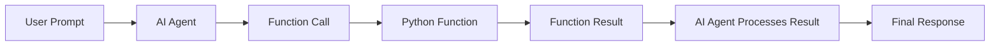

---
lab:
    title: 'Use a custom function in an AI agent'
    description: 'Learn how to use functions to add custom capabilities to your agents.'
    level: 300
    duration: 50
    islab: true
    status: 'released'
---

# Use a custom function in an AI agent

In this exercise you'll explore creating an agent that can use custom functions as a tool to complete tasks. The agent will act as an astronomy assistant that can provide information about astronomical events and calculate the cost of telescope rentals based on user inputs. You'll define the function tools and implement the logic to process function calls made by the agent.

> **Tip**: The code used in this exercise is based on the Microsoft Foundry SDK for Python. You can develop similar solutions using the SDKs for Microsoft .NET, JavaScript, and Java. Refer to [Microsoft Foundry SDK client libraries](https://learn.microsoft.com/azure/ai-foundry/how-to/develop/sdk-overview) for details.

This exercise should take approximately **50** minutes to complete.

> **Note**: Some of the technologies used in this exercise are in preview or in active development. You may experience some unexpected behavior, warnings, or errors.

## Prerequisites

Before starting this exercise, ensure you have:

- [Visual Studio Code](https://code.visualstudio.com/) installed on your local machine
- An active [Azure subscription](https://azure.microsoft.com/free/)
- [Python 3.13](https://www.python.org/downloads/) or later installed
- [Git](https://git-scm.com/downloads) installed on your local machine

> \* Python 3.14 is available, but some dependencies are not yet compiled for that release. The lab has been successfully tested with Python 3.13.12.

## Create a Foundry project with the Foundry Toolkit for VS Code extension (If created skip to **Use the deployed model**)

1. Before starting the lab, install Azure CLI using the following link: [https://aka.ms/installazurecliwindows](https://aka.ms/installazurecliwindows). Click the link to download the installer. The download will start automatically and the installer will be available in your **Downloads** folder. If the download does not start automatically, copy and paste the link into your browser.

    

2. After the download is complete, run the installer and follow the installation steps.

    

As a developer, you may spend time working in the Microsoft Foundry portal, but most development tasks are typically performed in Visual Studio Code. The Foundry Toolkit extension enables you to work with Foundry project resources directly within Visual Studio Code, allowing you to stay within your development environment.

1. Open Visual Studio Code.

2. Select **Extensions** from the left pane (or press **Ctrl+Shift+X**).

3. Search the Extensions Marketplace for the **Foundry Toolkit** extension from Microsoft and select **Install**.

    > **Note**: The extension is currently listed as **Foundry Toolkit for VS Code**, but some VS Code labels, commands, or older screenshots may still refer to **AI Toolkit**. In this lab, treat those names as referring to the same extension experience. Below is a snippet of the new version, which is the official **Foundry Toolkit for VS Code** extension published by Microsoft.

    

4. After installing the extension, select its icon in the sidebar to open the Foundry Toolkit view.

    You'll initially see the default **My Resources** and **Developer Tools** sections in the panel, but they won't be populated with your actual project data. To use the extension's full functionality and complete this lab, you need to sign in to your Azure account.

    

5. Open the integrated terminal (**Ctrl+Shift+`**) and run the following command to sign in to Azure:

    ```powershell
    az login
    ```

    A browser window will open automatically, asking you to sign in. Select the email address provided by your trainer, then select **Continue**.

    Back in the terminal, you'll see a prompt similar to:

    ```
    Select a subscription and tenant (Type a number or Enter for no changes):
    ```

    Type **1** and press **Enter** to select the default subscription (or the one provided by your trainer). You'll then see confirmation that the default subscription has been set, along with your account details.

    > **Note**: Sometimes you might additionally be prompted to sign in to Azure below this step too — if so, complete that sign-in the same way, using the same assigned account. You might be prompted to authenticate more than once during the setup process. If prompted, use the same assigned account to complete each authentication request.

    If the sign-in completes without any issues, skip ahead to step 8. If you see an error saying the `az` command isn't recognized, go to step 6. If the sign-in window closes or gets cancelled partway through, go to step 7.

6. If the `az` command isn't recognized (e.g., `'az' is not recognized as a name of a cmdlet, function, script file, or executable program`), Azure CLI likely isn't installed correctly, or the terminal session started before the installation finished updating your PATH.

    > **Troubleshooting**: To fix this:
    > 1. Close and reopen the integrated terminal (or restart VS Code entirely), then try `az login` again.
    > 2. If the error persists, uninstall and reinstall Azure CLI using the following commands:
    >    ```powershell
    >    winget uninstall Microsoft.AzureCLI
    >    winget install Microsoft.AzureCLI
    >    ```
    > 3. Restart the terminal after installation completes, then run `az login` again.

7. If the sign-in window is closed accidentally or cancelled (you may see `User cancelled the Accounts Control Operation`), run the following commands to reset the session and try again:

    ```powershell
    az logout
    az login
    ```

8. Verify that a default project is already active. The project name will appear under **My Resources**.

    > **Tip**: To switch to a different project, select **Models** in the left panel under **My Resources**. You'll see two options: **Switch Project** and **Create Project**. Select **Switch Project** to change your default Azure Resources project.

    

## Use the deployed model

Use the deployed model that's already available in your Foundry project. Right-click the name of the project deployment and select **Copy Project Endpoint**. You'll need this URL to connect your agent to the Foundry project in the next steps.


# Get the application files from GitHub

> **Note**: If you've already downloaded and extracted the repository in a previous lab, skip ahead to step 5 below.

1. If you already downloaded and extracted this repository's ZIP file in a previous exercise, skip ahead to the next step, and navigate directly to the folder path below. Otherwise, follow the steps below to download it first.

2. Open a web browser and go to the [lab files on GitHub](https://github.com/Kiran-255666/agentic-ai-azure-ai-foundry-labs).

3. On the repository page, select the green **`<> Code`** button, and then select **Download ZIP**.

4. Once the download finishes, locate the ZIP file and extract it to a folder on your computer.

5. In the extracted folder, navigate to:

   ```
   agentic-ai-azure-ai-foundry-labs\labfiles\Day-05\Lab-01-agent-custom-tools\Python
   ```

   This folder already contains the application files and the required code for this exercise.

   > **Note**: The `agent.py` and `functions.py` files have already been updated with the implementation required for this exercise. You do not need to manually enter the code again. However, we strongly recommend reviewing the code and understanding each section before running the application.

6. In **File Explorer**, select the address bar at the top of the window, type the following command, and press **Enter**:

   ```
   code .
   ```

   This opens the folder directly in Visual Studio Code.

   > **Tip**: If `code .` doesn't work, open the folder manually in Visual Studio Code.

7. Right-click on the **requirements.txt** file and select **Open in Integrated Terminal**.

8. In the terminal, enter the following commands to create and activate a virtual environment and install the required Python packages:

   ```
   python -m venv labenv
   .\labenv\Scripts\Activate.ps1
   pip install -r requirements.txt
   ```

9. Open the **.env** file and configure the following values:

   ```
   PROJECT_ENDPOINT="<your-project-endpoint>"
   MODEL_DEPLOYMENT_NAME="<your-model-deployment-name>"
   ```

   Replace `<your-project-endpoint>` with the endpoint for your project and `<your-model-deployment-name>` with the name of your deployed model.

   Use **Ctrl+S** to save the file.

   > **Tip**: The project endpoint can be copied from the project deployment resource in the Foundry Toolkit VS Code extension.

You are now ready to review and run an AI agent that uses custom function tools.

## Review the functions used by the agent

The required functions have already been added to **`functions.py`**. Review the file before running the application.

The file contains three functions:

* `next_visible_event()` — finds the next astronomical event visible from a specified location.
* `calculate_observation_cost()` — calculates telescope observation costs based on telescope tier, duration, and priority.
* `generate_observation_report()` — generates a summary of an astronomical observation.

### `next_visible_event`

The implementation is:

```python
# Determine the next visible astronomical event for a given location
def next_visible_event(location: str) -> str:
    """Returns the next visible astronomical event for a location."""

    today = int(datetime.now().strftime("%m%d"))
    loc = location.lower().replace(" ", "_")

    for name, event_type, date, date_str, locs in EVENTS:
        if loc in locs and date >= today:
            return json.dumps({
                "event": name,
                "type": event_type,
                "date": date_str,
                "visible_from": sorted(locs)
            })

    return json.dumps({
        "message": f"No upcoming events found for {location}."
    })
```

This function searches the sample astronomical event data and returns the next event visible from the specified location as a JSON string.

### `calculate_observation_cost`

The implementation is:

```python
# Calculate the cost of an astronomical observation
def calculate_observation_cost(
    telescope_tier: str,
    hours: float,
    priority: str
) -> str:
    """Calculate telescope observation cost."""

    tier_rates = {
        "standard": 100,
        "advanced": 200,
        "premium": 350
    }

    priority_multipliers = {
        "low": 0.8,
        "normal": 1.0,
        "high": 1.5
    }

    tier = telescope_tier.lower()
    priority_level = priority.lower()

    if tier not in tier_rates:
        return json.dumps({
            "error": f"Unknown telescope tier: {telescope_tier}"
        })

    if priority_level not in priority_multipliers:
        return json.dumps({
            "error": f"Unknown priority level: {priority}"
        })

    base_cost = tier_rates[tier] * hours
    total_cost = base_cost * priority_multipliers[priority_level]

    return json.dumps({
        "telescope_tier": telescope_tier,
        "hours": hours,
        "priority": priority,
        "cost": total_cost
    })
```

This function calculates the observation cost by combining the telescope's hourly rate with the priority multiplier.

### `generate_observation_report`

The implementation is:

```python
# Generate an observation report
def generate_observation_report(
    event_name: str,
    location: str,
    telescope_tier: str,
    hours: float,
    priority: str,
    observer_name: str
) -> str:
    """Generate a summary report for an astronomical observation."""

    return json.dumps({
        "event_name": event_name,
        "location": location,
        "telescope_tier": telescope_tier,
        "hours": hours,
        "priority": priority,
        "observer_name": observer_name,
        "status": "Observation report generated successfully"
    })
```

This function receives the observation details and returns them as a JSON-formatted report.

> **Important**: The functions have already been added to `functions.py`. Review the implementation rather than adding the functions manually.

## Review the Foundry project connection

Open **`agent.py`** and review the imports and project connection.

The required imports have already been added:

```python
import os
import json
from dotenv import load_dotenv

# Add references
from azure.ai.projects import AIProjectClient
from azure.ai.projects.models import PromptAgentDefinition, FunctionTool
from azure.identity import AzureCliCredential
from openai.types.responses.response_input_param import (
    FunctionCallOutput,
    ResponseInputParam,
)

from functions import (
    next_visible_event,
    calculate_observation_cost,
    generate_observation_report,
)
```

Notice that the three functions from `functions.py` are imported so they can be executed when the agent requests the corresponding function tools.

The application loads the project configuration from `.env`:

```python
load_dotenv()
project_endpoint = os.getenv("PROJECT_ENDPOINT")
model_deployment = os.getenv("MODEL_DEPLOYMENT_NAME")
```

The application then connects to the Foundry project using `AzureCliCredential`:

```python
# Connect to the project client
with (
    AzureCliCredential() as credential,
    AIProjectClient(
        endpoint=project_endpoint,
        credential=credential
    ) as project_client,
    project_client.get_openai_client() as openai_client,
):
```

> **Note**: The application uses `AzureCliCredential`, so make sure you authenticate with Azure CLI before running the application.

## Review the function tools

The three function tools have already been defined in **`agent.py`**.

### Event function tool

```python
# Define the event function tool
event_tool = FunctionTool(
    name="next_visible_event",
    description="Get the next visible event in a given location.",
    parameters={
        "type": "object",
        "properties": {
            "location": {
                "type": "string",
                "description": (
                    "continent to find the next visible event in "
                    "(e.g. 'north_america', 'south_america', 'australia')"
                ),
            },
        },
        "required": ["location"],
        "additionalProperties": False,
    },
    strict=True,
)
```

### Observation cost function tool

```python
# Define the observation cost function tool
cost_tool = FunctionTool(
    name="calculate_observation_cost",
    description=(
        "Calculate the cost of an observation based on the "
        "telescope tier, number of hours, and priority level."
    ),
    parameters={
        "type": "object",
        "properties": {
            "telescope_tier": {
                "type": "string",
                "description": (
                    "the tier of the telescope "
                    "(e.g. 'standard', 'advanced', 'premium')"
                ),
            },
            "hours": {
                "type": "number",
                "description": "the number of hours for the observation",
            },
            "priority": {
                "type": "string",
                "description": (
                    "the priority level of the observation "
                    "(e.g. 'low', 'normal', 'high')"
                ),
            },
        },
        "required": [
            "telescope_tier",
            "hours",
            "priority",
        ],
        "additionalProperties": False,
    },
    strict=True,
)
```

### Observation report function tool

```python
# Define the observation report generation function tool
report_tool = FunctionTool(
    name="generate_observation_report",
    description="Generate a report summarizing an astronomical observation",
    parameters={
        "type": "object",
        "properties": {
            "event_name": {
                "type": "string",
                "description": (
                    "the name of the astronomical event being observed"
                ),
            },
            "location": {
                "type": "string",
                "description": "the location of the observer",
            },
            "telescope_tier": {
                "type": "string",
                "description": (
                    "the tier of the telescope used for the observation "
                    "(e.g. 'standard', 'advanced', 'premium')"
                ),
            },
            "hours": {
                "type": "number",
                "description": (
                    "the number of hours the telescope was used "
                    "for the observation"
                ),
            },
            "priority": {
                "type": "string",
                "description": (
                    "the priority level of the observation "
                    "(e.g. 'low', 'normal', 'high')"
                ),
            },
            "observer_name": {
                "type": "string",
                "description": (
                    "the name of the person who conducted the observation"
                ),
            },
        },
        "required": [
            "event_name",
            "location",
            "telescope_tier",
            "hours",
            "priority",
            "observer_name",
        ],
        "additionalProperties": False,
    },
    strict=True,
)
```

> **Important**: These tool definitions are already present in `agent.py`. Review the JSON schema for each tool to understand how the agent supplies arguments to the Python functions.

## Review the agent creation

The application creates an astronomy agent using the three function tools:

```python
# Create a new agent with the function tools
agent = project_client.agents.create_version(
    agent_name="astronomy-agent",
    definition=PromptAgentDefinition(
        model=model_deployment,
        instructions="""
        You are an astronomy observations assistant that helps users find
        information about astronomical events and calculate telescope rental costs.
        Use the available tools to assist users with their inquiries.
        """,
        tools=[
            event_tool,
            cost_tool,
            report_tool,
        ],
    ),
)
```

The agent is configured with:

* The deployed model specified by `MODEL_DEPLOYMENT_NAME`.
* Instructions describing its role.
* Three custom function tools.

> **Important**: The agent creation code has already been added. Review it before executing the application.

## Review the conversation and function-call flow

The application creates a conversation:

```python
# Create a conversation for the chat session
conversation = openai_client.conversations.create()
```

A list is also created to hold function-call outputs:

```python
# Create a list to hold function call outputs
input_list: ResponseInputParam = []
```

When the user enters a prompt, it is added to the conversation:

```python
# Send a prompt to the agent
openai_client.conversations.items.create(
    conversation_id=conversation.id,
    items=[
        {
            "type": "message",
            "role": "user",
            "content": user_input,
        }
    ],
)
```

The application then retrieves the agent's response:

```python
# Retrieve the agent's response
response = openai_client.responses.create(
    conversation=conversation.id,
    extra_body={
        "agent_reference": {
            "name": agent.name,
            "type": "agent_reference",
        }
    },
    input=input_list,
)

# Check the run status for failures
if response.status == "failed":
    print(f"Response failed: {response.error}")
```

## Review function-call processing

When the model requests a function, the application identifies the requested function and executes the corresponding Python function:

```python
# Process function calls
for item in response.output:

    if item.type == "function_call":

        result = None

        if item.name == "next_visible_event":
            result = next_visible_event(
                **json.loads(item.arguments)
            )

        elif item.name == "calculate_observation_cost":
            result = calculate_observation_cost(
                **json.loads(item.arguments)
            )

        elif item.name == "generate_observation_report":
            result = generate_observation_report(
                **json.loads(item.arguments)
            )

        input_list.append(
            FunctionCallOutput(
                type="function_call_output",
                call_id=item.call_id,
                output=result,
            )
        )
```

The function output is then sent back to the agent:

```python
# Send function call outputs back to the model
if input_list:

    response = openai_client.responses.create(
        input=input_list,
        previous_response_id=response.id,
        extra_body={
            "agent_reference": {
                "name": agent.name,
                "type": "agent_reference",
            }
        },
    )

# Display the agent's response
print(f"AGENT: {response.output_text}")
```

This creates the following flow:



> **Important**: All of this functionality has already been implemented in `agent.py`. Review the code and understand how the function-call cycle works before running the application.


## Run the agent application

1. In the integrated terminal, authenticate with Azure:

   ```
   az login
   ```

2. Make sure the virtual environment is activated:

   ```
   .\labenv\Scripts\Activate.ps1
   ```

3. Run the application:

   ```
   python agent.py
   ```

4. The application will create the agent and display a prompt similar to:

   ```text
   Enter a prompt for the astronomy agent. Use 'quit' to exit.
   USER:
   ```

5. Enter a prompt such as:

   ```
   Find me the next event I can see from South America and give me the cost for 5 hours of premium telescope time at normal priority.
   ```

   This prompt asks the agent to use both `next_visible_event` and `calculate_observation_cost`.

   The agent should invoke the appropriate function tools, process their results, and return a response.

   > **Tip**: The initial startup may take some time because the application connects to Azure and creates the agent in the Foundry project.

   > **Tip**: If the application fails because the rate limit is exceeded, wait a few seconds and try again. If there is insufficient model quota in your subscription, the model may not be able to respond.

6. Enter a follow-up prompt to generate an observation report, such as:

   ```
   Generate that information in a report for Bellows College.
   ```

   The agent should use the `generate_observation_report` function and return the generated report information.

7. Review the response returned by the agent.

8. Enter:

   ```
   quit
   ```

   to exit the application.

9. The application deletes the agent version before exiting:

   ```python
   # Delete the agent when done
   project_client.agents.delete_version(
       agent_name=agent.name,
       agent_version=agent.version,
   )

   print("Deleted agent.")
   ```

10. You can also use the following command to deactivate the Python virtual environment:

```
deactivate
```

> **Note**: The application files in this exercise have already been updated with the complete implementation. The purpose of these sections is to help you review and understand the implementation rather than requiring you to manually re-enter the code.

## Review the results

After running the application, verify that:

- The astronomy agent is created successfully.
- The agent can identify the appropriate function tool based on the user's prompt.
- `next_visible_event` returns the next visible astronomical event.
- `calculate_observation_cost` calculates the telescope observation cost.
- `generate_observation_report` generates the observation report details.
- The function results are returned to the agent and incorporated into the final response.
- The application exits successfully when you enter `quit`.
- The agent version is deleted when the application exits.

The overall function-calling flow is:

```mermaid
flowchart LR
    A[User Prompt] --> B[AI Agent]
    B --> C[Function Call]
    C --> D[Python Function]
    D --> E[Function Result]
    E --> F[AI Agent Processes Result]
    F --> G[Final Response]
````

## Summary

In this exercise, you reviewed how to create an Azure AI agent with custom function tools. The application:

* Connects to an Azure AI Foundry project.
* Defines custom Python functions as agent tools.
* Creates an agent with multiple function tools.
* Sends user prompts to the agent.
* Processes function calls requested by the agent.
* Executes the corresponding Python functions.
* Sends the function results back to the agent.
* Displays the agent's final response.
* Deletes the agent version when the application exits.

You have now completed the custom function tools workflow and can use the same pattern to extend an AI agent with additional application-specific functionality.
