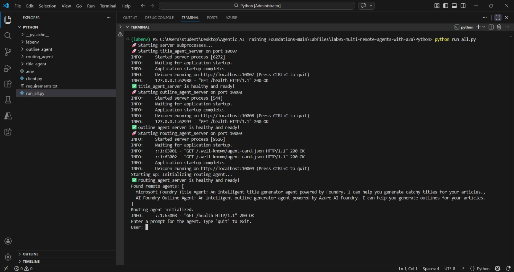
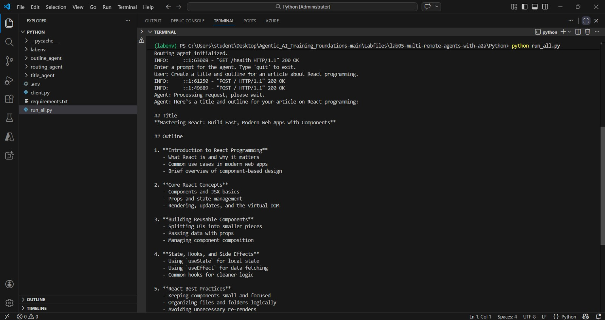

---
lab:
    title: 'Connect to remote agents with A2A protocol'
    description: 'Use the A2A protocol to collaborate with remote agents.'
    level: 300
    duration: 30
    islab: true
    status: 'released'
---

# Connect to remote agents with A2A protocol

In this exercise, you'll use Azure AI Agent Service with the A2A protocol to create simple remote agents that interact with one another. These agents will assist technical writers with preparing their developer blog posts. A title agent will generate a headline, and an outline agent will use the title to develop a concise outline for the article. Let's get started.

> **Tip**: The code used in this exercise is based on the Microsoft Foundry SDK for Python. You can develop similar solutions using the SDKs for Microsoft .NET, JavaScript, and Java. Refer to [Microsoft Foundry SDK client libraries](https://learn.microsoft.com/azure/ai-foundry/how-to/develop/sdk-overview) for details.

This exercise should take approximately **30** minutes to complete.

> **Note**: Some of the technologies used in this exercise are in preview or in active development. You may experience some unexpected behavior, warnings, or errors.

## Prerequisites

Before starting this exercise, ensure you have:

- [Visual Studio Code](https://code.visualstudio.com/) installed on your local machine
- An active [Azure subscription](https://azure.microsoft.com/free/)
- [Python 3.13](https://www.python.org/downloads/) or later installed


> \* Python 3.13 is available, but some dependencies are not yet compiled for that release. The lab has been successfully tested with Python 3.13.12.

## Access your Foundry project with the Foundry Toolkit for VS Code extension 
1. Before we start with this exercise, let's download Azure CLI using the link- https://aka.ms/installazurecliwindows (browser the URL in any browser to download it) and after downloading it, please install it.
As a developer, you may spend some time working in the Foundry portal; but you’re also likely to spend a lot of time in Visual Studio Code. The Foundry Toolkit for VS Code extension provides a convenient way to work with Foundry project resources without leaving the development environment.

1. Open Visual Studio Code.

2. Select **Extensions** from the left pane (or press **Ctrl+Shift+X**).

3. Search the Extensions Marketplace for the **Foundry Toolkit** extension from Microsoft and select **Install**.

    > **Note**: The extension is currently listed as **Foundry Toolkit for VS Code**, but some VS Code labels, commands, or older screenshots may still refer to **AI Toolkit**. In this lab, treat those names as referring to the same extension experience. Below is a snippet of the new version, which is the official **Foundry Toolkit for VS Code** extension published by Microsoft.

    

4. After installing the extension, select its icon in the sidebar to open the Foundry Toolkit view.

    You'll initially see the default **My Resources** and **Developer Tools** sections in the panel, but they won't be populated with your actual project data. To use the extension's full functionality and complete this lab, you need to sign in to your Azure account.

    

5. Open the integrated terminal (**Ctrl+Shift+`**) and run the following command to sign in to Azure:

    ```powershell
    az login
    ```

    A browser window will open automatically, asking you to sign in. Select the email address provided by your trainer, then select **Continue**.

    Back in the terminal, you'll see a prompt similar to:

    ```
    Select a subscription and tenant (Type a number or Enter for no changes):
    ```

    Type **1** and press **Enter** to select the default subscription (or the one provided by your trainer). You'll then see confirmation that the default subscription has been set, along with your account details.

    > **Note**: Sometimes you might additionally be prompted to sign in to Azure below this step too — if so, complete that sign-in the same way, using the same assigned account. You might be prompted to authenticate more than once during the setup process. If prompted, use the same assigned account to complete each authentication request.

    If the sign-in completes without any issues, skip ahead to step 8. If you see an error saying the `az` command isn't recognized, go to step 6. If the sign-in window closes or gets cancelled partway through, go to step 7.

6. If the `az` command isn't recognized (e.g., `'az' is not recognized as a name of a cmdlet, function, script file, or executable program`), Azure CLI likely isn't installed correctly, or the terminal session started before the installation finished updating your PATH.

    > **Troubleshooting**: To fix this:
    > 1. Close and reopen the integrated terminal (or restart VS Code entirely), then try `az login` again.
    > 2. If the error persists, uninstall and reinstall Azure CLI using the following commands:
    >    ```powershell
    >    winget uninstall Microsoft.AzureCLI
    >    winget install Microsoft.AzureCLI
    >    ```
    > 3. Restart the terminal after installation completes, then run `az login` again.

7. If the sign-in window is closed accidentally or cancelled (you may see `User cancelled the Accounts Control Operation`), run the following commands to reset the session and try again:

    ```powershell
    az logout
    az login
    ```

8. Verify that a default project is already active. The project name will appear under **My Resources**.

    > **Tip**: To switch to a different project, select **Models** in the left panel under **My Resources**. You'll see two options: **Switch Project** and **Create Project**. Select **Switch Project** to change your default Azure Resources project.

    

## Download the starter code repository

For this exercise, you'll use starter code that will help you connect to your Foundry project and create an agent that uses MCP server tools.

1. In a browser like Microsoft Edge, browse the URL: https://github.com/Kiran-255666/agentic-ai-azure-ai-foundry-labs and download the repository into your VM.
2. The Repository will get download in Downloads folder, right click the file and select Extract all to unzip the zip file.
3. In VS Code, click on File menu, then select open Folder.
4. Select the folder that you have unzipped in the previous step.
1. Once the repository opens, Open Visual Studio code, select **File > Open Folder** and navigate to `agentic-ai-azure-ai-foundry-labs\labfiles\Day-05\Lab-04-multi-remote-agents-with-a2a\python`

1. Right-click on the **requirements.txt** file and select **Open in Integrated Terminal**.

1. In the terminal, enter the following command to install the required Python packages in a virtual environment:

    ```
   python -m venv labenv
   .\labenv\Scripts\Activate.ps1
   pip install -r requirements.txt
    ```

1. Open the **.env** file, replace the **your_project_endpoint** placeholder with the endpoint for your project copied from the project deployment resource in the Foundry Toolkit extension. If the endpoint does not work, copy the **Project endpoint** from your project in the Azure AI Foundry portal (**https://ai.azure.com/**). Ensure that the **MODEL_DEPLOYMENT_NAME** variable is set to your model deployment name, then use **Ctrl+S** to save the file.

## Create a discoverable agent (We have already updated the mentioned files with the code mentioned in the instructions, but we would highly suggest going through it before executing it)

In this task, you create the title agent that helps writers create trendy headlines for their articles. You also define the agent's skills and card required by the A2A protocol to make the agent discoverable.

> **Tip**: As you add code, be sure to maintain the correct indentation. Use the existing comments as a guide, entering the new code at the same level of indentation.

1. Open the **title_agent/agent.py** file in the code editor.

1. Find the comment **Create the agents client** and add the following code to connect to the Azure AI project:

    > **Tip**: Be careful to maintain the correct indentation level.

    ```python
   # Create the agents client
   self.client = AgentsClient(
       endpoint=os.environ['PROJECT_ENDPOINT'],
       credential=DefaultAzureCredential(
           exclude_environment_credential=True,
           exclude_managed_identity_credential=True
       )
   )
    ```

1. Find the comment **Create the title agent** and add the following code to create the agent:

    ```python
   # Create the title agent
   self.agent = self.client.create_agent(
       model=os.environ['MODEL_DEPLOYMENT_NAME'],
       name='title-agent',
       instructions="""
       You are a helpful writing assistant.
       Given a topic the user wants to write about, suggest a single clear and catchy blog post title.
       """,
   )
    ```

1. Find the comment **Create a thread for the chat session** and add the following code to create the chat thread:

    ```python
   # Create a thread for the chat session
   thread = self.client.threads.create()
    ```

1. Locate the comment **Send user message** and add this code to submit the user's prompt:

    ```python
   # Send user message
   self.client.messages.create(thread_id=thread.id, role=MessageRole.USER, content=user_message)
    ```

1. Under the comment **Create and run the agent**, add the following code to initiate the agent's response generation:

    ```python
   # Create and run the agent
   run = self.client.runs.create_and_process(thread_id=thread.id, agent_id=self.agent.id)
    ```

    The code provided in the rest of the file will process and return the agent's response.

1. Save the code file (*CTRL+S*). Now you're ready to share the agent's skills and card with the A2A protocol.

1. Open the **title_agent/server.py** file in the code editor.

1. Find the comment **Define agent skills** and add the following code to specify the agent’s functionality:
   **(We have already updated the mentioned files with the code mentioned in the instructions, but we would highly suggest going through it before executing it)**

    ```python
   # Define agent skills
   skills = [
       AgentSkill(
           id='generate_blog_title',
           name='Generate Blog Title',
           description='Generates a blog title based on a topic',
           tags=['title'],
           examples=[
               'Can you give me a title for this article?',
           ],
       ),
   ]
    ```

1. Find the comment **Create agent card** and add this code to define the metadata that makes the agent discoverable:

    ```python
   # Create agent card
   agent_card = AgentCard(
       name='Microsoft Foundry Title Agent',
       description='An intelligent title generator agent powered by Foundry. '
       'I can help you generate catchy titles for your articles.',
       url=f'http://{host}:{port}/',
       version='1.0.0',
       default_input_modes=['text'],
       default_output_modes=['text'],
       capabilities=AgentCapabilities(),
       skills=skills,
   )
    ```

1. Locate the comment **Create agent executor** and add the following code to initialize the agent executor using the agent card:

    ```python
   # Create agent executor
   agent_executor = create_foundry_agent_executor(agent_card)
    ```

    The agent executor will act as a wrapper for the title agent you created.

1. Find the comment **Create request handler** and add the following to handle incoming requests using the executor:

    ```python
   # Create request handler
   request_handler = DefaultRequestHandler(
       agent_executor=agent_executor, task_store=InMemoryTaskStore()
   )
    ```

1. Under the comment **Create A2A application**, add this code to create the A2A-compatible application instance:

    ```python
   # Create A2A application
   a2a_app = A2AStarletteApplication(
       agent_card=agent_card, http_handler=request_handler
   )
    ```

    This code creates an A2A server that will share the title agent's information and handle incoming requests for this agent using the title agent executor.

1. Save the code file (*CTRL+S*) when you have finished.

## Enable messages between the agents (We have already updated the mentioned files with the code mentioned in the instructions, but we would highly suggest going through it before executing it)

In this task, you use the A2A protocol to enable the routing agent to send messages to the other agents. You also allow the title agent to receive messages by implementing the agent executor class.

1. Open the **routing_agent/agent.py** file in the code editor.

    The routing agent acts as an orchestrator that handles user messages and determines which remote agent should process the request.

    When a user message is received, the routing agent:
    - Starts a conversation thread.
    - Uses the `create_and_process` method to evaluate the best-matching agent for the user's message.
    - The message is routed to the appropriate agent over HTTP using the `send_message` function.
    - The remote agent processes the message and returns a response.

    The routing agent finally captures the response and returns it to the user through the thread.

    Notice that the `send_message` method is async and must be awaited for the agent run to complete successfully.

1. Add the following code under the comment **Retrieve the remote agent's A2A client using the agent name**:

    ```python
   # Retrieve the remote agent's A2A client using the agent name 
   client = self.remote_agent_connections[agent_name]
    ```

1. Locate the comment **Construct the payload to send to the remote agent** and add the following code:

    ```python
   # Construct the payload to send to the remote agent
   payload: dict[str, Any] = {
       'message': {
           'role': 'user',
           'parts': [{'kind': 'text', 'text': task}],
           'messageId': message_id,
       },
   }
    ```

1. Find the comment **Wrap the payload in a SendMessageRequest object** and add the following code:

    ```python
   # Wrap the payload in a SendMessageRequest object
   message_request = SendMessageRequest(id=message_id, params=MessageSendParams.model_validate(payload))
    ```

1. Add the following code under the comment **Send the message to the remote agent client and await the response**:

    ```python
   # Send the message to the remote agent client and await the response
   send_response: SendMessageResponse = await client.send_message(message_request=message_request)
    ```

1. Save the code file (*CTRL+S*) when you have finished. Now the routing agent is able to discover and send messages to the title agent. Let's create the agent executor code to handle those incoming messages from the routing agent.

1. Open the **title_agent/agent_executor.py** file in the code editor. (We have already updated the mentioned files with the code mentioned in the instructions, but we would highly suggest going through it before executing it)

    The `AgentExecutor` class implementation must contain the methods `execute` and `cancel`. The cancel method has been provided for you. The `execute` method includes a `TaskUpdater` object that manages events and signals to the caller when the task is complete. Let's add the logic for task execution.

1. In the `execute` method, add the following code under the comment **Process the request**:

    ```python
   # Process the request
   await self._process_request(context.message.parts, context.context_id, updater)
    ```

1. In the `_process_request` method, add the following code under the comment **Get the title agent**:

    ```python
   # Get the title agent
   agent = await self._get_or_create_agent()
    ```

1. Add the following code under the comment **Update the task status**:

    ```python
   # Update the task status
   await task_updater.update_status(
       TaskState.working,
       message=new_agent_text_message('Title Agent is processing your request...', context_id=context_id),
   )
    ```

1. Find the comment **Run the agent conversation** and add the following code:

    ```python
   # Run the agent conversation
   responses = await agent.run_conversation(user_message)
    ```

1. Find the comment **Update the task with the responses** and add the following code:

    ```python
   # Update the task with the responses
   for response in responses:
       await task_updater.update_status(
           TaskState.working,
           message=new_agent_text_message(response, context_id=context_id),
       )
    ```

1. Find the comment **Mark the task as complete** and add the following code:

    ```python
   # Mark the task as complete
   final_message = responses[-1] if responses else 'Task completed.'
   await task_updater.complete(
       message=new_agent_text_message(final_message, context_id=context_id)
   )
    ```

    Now your title agent has been wrapped with an agent executor that the A2A protocol will use to handle messages. Great work!

## Test the application

1. In the integrated terminal, check whether you're already signed in to Azure:

    ```bash
    az account show
    ```

    - If the command displays your account details, you're already signed in and can proceed to the next step.
    - If it returns an error or no account information, sign in by running:

    ```bash
    az login
    ```

1. Run the application:

    ```bash
    python run_all.py
    ```

    The application uses the credentials from your authenticated Azure session to connect to your Azure AI Foundry project and create and run the agent. You should see output from each server as it starts.

    

1. Wait until the prompt for input appears, then enter a prompt such as:

    ```
    Create a title and outline for an article about React programming.
    ```

    After a few moments, you should see a response from the agent with the result.

    

1. Enter `quit` to exit the program and stop the servers.

    You can also use `deactivate` to exit the Python virtual environment in the terminal.