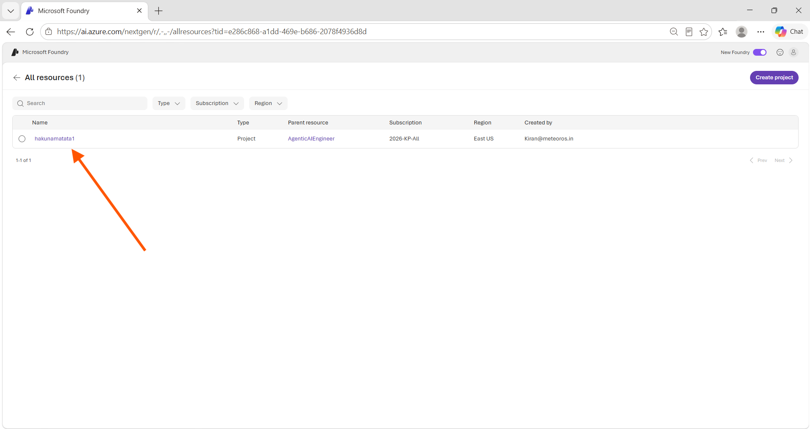
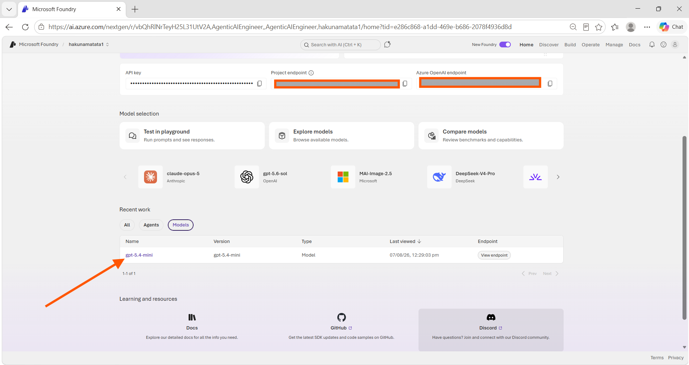
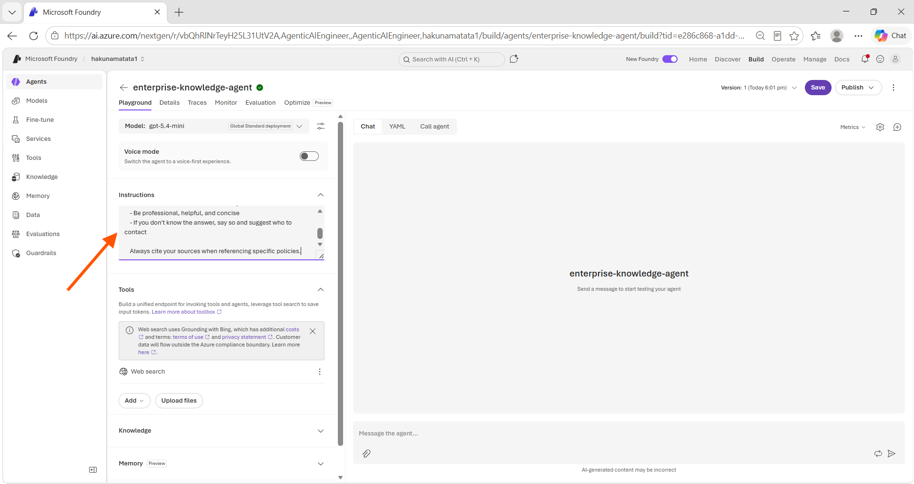
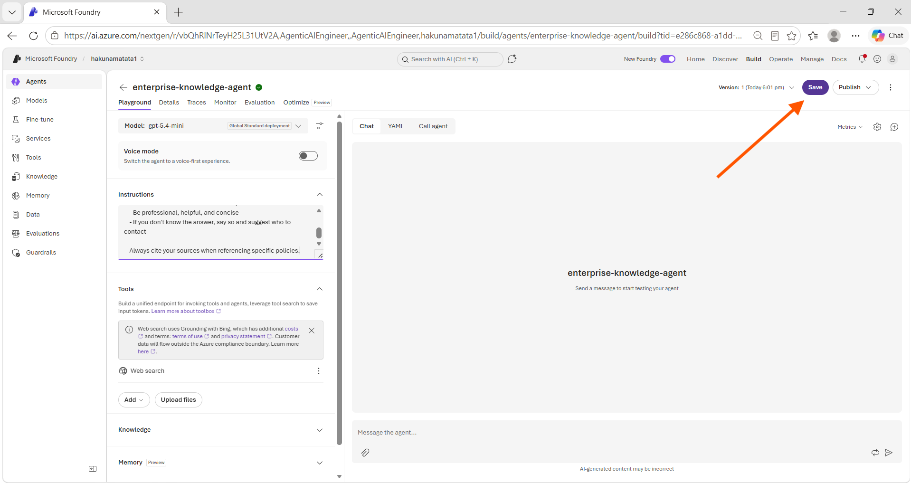
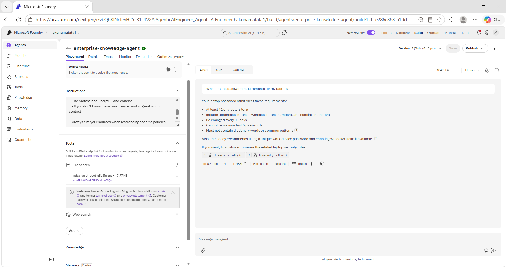
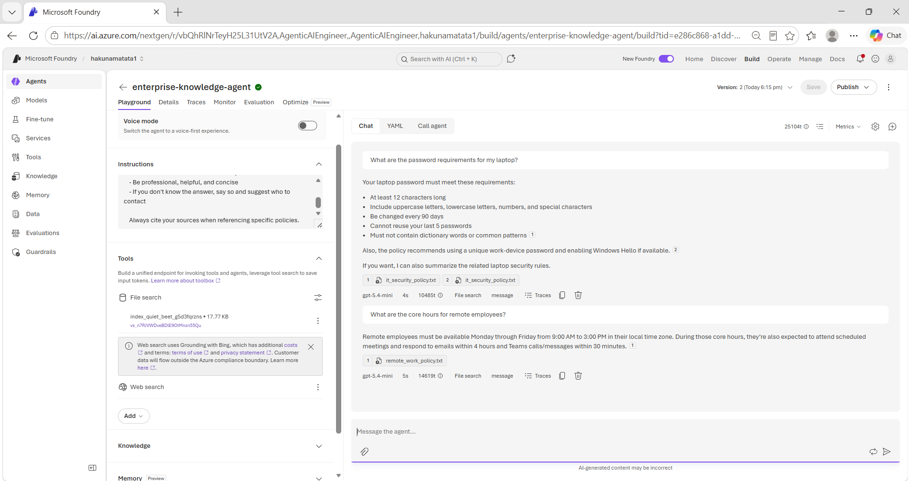
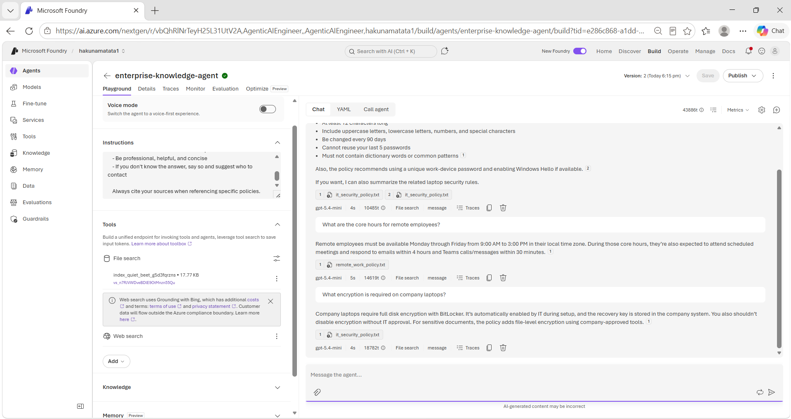
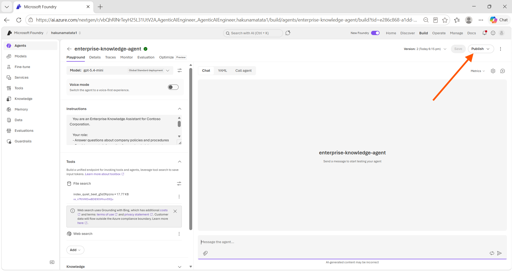
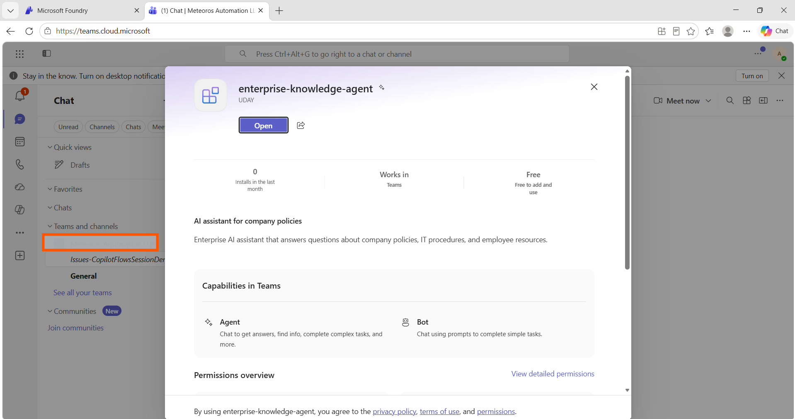
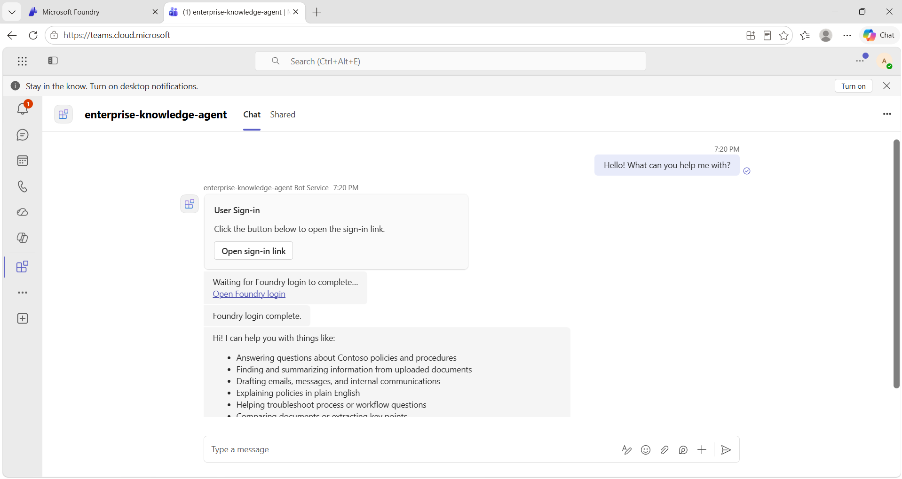

---
lab:
    title: 'Deploy agents to Microsoft Teams'
    description: 'Publish AI agents to Microsoft Teams"'
    level: 300
    duration: 40
    islab: true
    status: 'released'
---

# Deploy agents to Microsoft Teams 

In this lab, you'll create and publish your own AI agent to **Microsoft Teams**. You'll use the existing Foundry project and deployed model available for the training, configure an enterprise knowledge agent with grounding documents, and publish it so employees can access it where they work.

This lab focuses on **agent creation, deployment, and publishing workflows**. You won't create a new Foundry project or deploy a model; however, you will create, configure, test, and publish your own agent in the existing project.

This lab takes approximately **40** minutes.

> **Note**: Teams deployment works with standard Microsoft 365 accounts.

## Prerequisites

Before starting this lab, ensure you have:

- An [Azure subscription](https://azure.microsoft.com/free/)
- A **Microsoft 365 account** with Teams access
- Basic familiarity with the Microsoft Foundry portal
- Access to the existing Foundry project and its deployed model

## Use the existing Foundry project

This lab uses the Foundry project and deployed model already provided for the training. You don't need to create a project or deploy a model.

1. In a web browser, open the [Foundry portal](https://ai.azure.com) and sign in using your Azure credentials.

    > **Important**: For this lab, use the **New Foundry** experience.

1. Select the existing training Foundry project from the project selector.

    

1. On the project home page, verify that the deployed chat model is available can be seen at the bottom of the page Under recent work Models

    

1. Keep the Foundry portal open. You'll create your own agent in this project next.

## Create your agent

Now create an enterprise knowledge agent that you'll configure and publish to Teams and Copilot.

1. On the Foundry project home page, select **Start building** in the **Build an agent** card.

    

1. In the **Create an agent** dialog, enter the following agent name:

    ```
    enterprise-knowledge-agent
    ```

1. Select **Create**.

    

1. After the agent is created, the agent playground opens. Verify that the existing deployed chat model is selected at the top of the configuration pane.

    

    The deployed model is already available in the project, so you can now focus on configuring the agent's behavior and knowledge grounding.

## Get the application files

The sample policy documents for this lab are included in the training repository.

> **Note**: If you've already downloaded and extracted the repository in an earlier lab, skip ahead to step 5 below.

1. If you already downloaded and extracted this repository's ZIP file in a previous exercise, skip ahead to the next step and navigate directly to the folder path below. Otherwise, follow the remaining steps to download it.
1. Open a web browser and go to the [lab files on GitHub](https://github.com/Kiran-255666/agentic-ai-azure-ai-foundry-labs).
1. On the repository page, select the green **`<> Code`** button, then select **Download ZIP**.

    

1. After the download finishes, locate the ZIP file and extract it to a folder on your computer.
1. In the extracted folder, navigate to:

    ```
    agentic-ai-azure-ai-foundry-labs\labfiles\Day-06\Lab-01-m365-teams-integration\python
    ```

    This folder contains the policy documents needed for this exercise.

    > **Tip**: If you're not sure which folder contains the exercise files, check with your trainer.

1. In **File Explorer**, select the address bar, type `code.` , and press **Enter**. This opens the folder directly in Visual Studio Code.

    > **Tip**: If `code .` doesn't work, open the folder manually in Visual Studio Code.

## Configure agent instructions and grounding data

Now configure your agent to answer questions about Contoso company policies. You'll add the agent instructions and attach the policy files from the repository you downloaded.

1. In the agent configuration page, set the **Instructions** to:

    ```
    You are an Enterprise Knowledge Assistant for Contoso Corporation.

    Your role:
    - Answer questions about company policies and procedures
    - Provide accurate information from uploaded documents
    - Be professional, helpful, and concise
    - If you don't know the answer, say so and suggest who to contact

    Always cite your sources when referencing specific policies.
    ```

    

1. Select **Save** to save the agent configuration.

    

1. In the folder you opened in Visual Studio Code, locate the following sample documents:

   ```
   sample_documents\it_security_policy.txt
   sample_documents\remote_work_policy.txt
   ```

1. Return to your agent configuration in the Foundry portal and scroll to the **Tools** section.
1. Select **Upload files**. In the **Attach files** dialog, you can either drag and drop the files or select **browse for files**.
1. Browse to the `sample_documents` folder and select the following policy files:
   ```text
   it_security_policy.txt
   remote_work_policy.txt
   ```
   Once the files are selected, you should see status being changed to **“Success”** for both files.
1. Select **Attach** to upload the files.
1. Select the **Save** button in the top-right corner.

Your agent now has grounding data and can use the attached documents to answer company-policy questions.

## Test the agent in the playground

Test the agent before publishing it. This confirms that the instructions and grounding documents are working correctly.

1. In the playground, ask the following question:

    ```
    What are the password requirements for my laptop?
    ```
    
    

1. Verify that the agent returns information from the IT security policy, such as a minimum 12-character password with uppercase, lowercase, numbers, and special characters.

1. Ask the following question:

    ```
    What are the core hours for remote employees?
    ```

1. Verify that the response uses the remote work policy and identifies the core hours as 9 AM to 3 PM.
    
    

1. Ask one more question:

    ```
    What encryption is required on company laptops?
    ```

1. Verify that the agent retrieves the BitLocker requirement from the IT security policy.
    
    

1. Select **Save** if you haven't already done so. If the changes are already saved, skip this step and proceed to the next step.

Your agent is now ready to publish. Next, prepare the Teams app information and icons required by the publishing flow.

## Publish to Microsoft Teams

When you publish an agent to Teams, Foundry prepares the Teams app package and configuration needed to make the agent available in Teams.

### Prepare publishing information

> **Note**: The current Foundry publishing flow collects the agent name, description, developer information, and other publishing details directly on the **Publish to Teams and Microsoft 365** page. You don't need to create a separate Teams app configuration or prepare app icons manually.

### Publish from the portal

1. Select **Publish** at the top of the page.
    
    

1. Select **Publish to Teams and Microsoft 365 Copilot**.

### Configure publishing details

1. Under **Agent**, verify that the agent name is:

   ```
   enterprise-knowledge-agent
   ```

2. Under **Publish version**, enter:

   ```
   1.0.0
   ```

3. Under **Short description**, enter:

   ```
   AI assistant for company policies
   ```

4. Under **Description**, enter:

   ```
   Enterprise AI assistant that answers questions about company policies, IT procedures, and employee resources
   ```

5. Under **Azure Bot Services**, verify that an Azure Bot Service is automatically populated.

   > **Note**: In the training environment, the field may be automatically populated with a bot service named `enterprise-knowledge-agent02370`. The bot service name may be different in your environment. If a bot service is populated, leave it as is. If you see an error message instead, contact your instructor before continuing.

6. Under **Developer**, enter your name or company name.

7. Under **Developer website**, enter:

   ```
   https://example.com
   ```

   > **Note**: If your organization provides a developer website, use that website instead of the example value.

8. Under **Terms of use**, enter:

   ```
   https://example.com
   ```

   > **Note**: If your organization provides a terms-of-use URL, use that URL instead of the example value.

9. Under **Privacy statement**, enter:

   ```
   https://example.com
   ```

   > **Note**: If your organization provides a privacy statement URL, use that URL instead of the example value.

10. Review the publishing information, then select **Next: Publish options**.

### Publish the agent to Teams

After selecting **Next: Publish options**, the **Publish options** page opens.

1. Under **Direct publish**, select **Just you**.

   > **Note**: **Just you** makes the agent available immediately for your personal use.

2. Select **Publish**.

3. Wait for the publishing process to complete successfully.

4. Click on **Publish** > **Teams & Microsoft 365 Copilot** > **Open in Teams**
    
    

### Test your agent in Teams

1. Open the agent in Teams you might agian needed a **Foundry login to access the agent**

2. After login Send a greeting:

```

Hello! What can you help me with?

```
    


3. Test a knowledge question:

```

What are the laptop password requirements?

```

4. Ask another question:

```

What MFA methods are supported?

```

5. Verify that the agent responds using the IT security policy document.

**Congratulations!** Your agent is now available in Microsoft Teams.

### Troubleshoot Teams publishing

**Can't find the agent in Teams after publishing:**

- Check **Apps** > **Your agents**.
- Wait one to two minutes for the agent to appear.
- Confirm that publishing completed successfully in the Foundry portal.

**Agent doesn't respond:**

- Test the agent in the Foundry playground first.
- Verify that the policy files were uploaded and grounding is enabled.
- Wait a short time after publishing for the agent to become available.

**Responses are generic:**

- Verify that the policy documents were attached to the agent.
- Test the same knowledge query in the Foundry playground.
- Confirm that the uploaded files finished processing.

## Cleanup

To avoid leaving an unused published agent, delete the agent and remove the installed app when you're finished.

### Delete the agent

1. In the Foundry portal, go to **Build** > **Agents**.
2. Find **enterprise-knowledge-agent**.
3. Select the **...** menu, then select **Delete**.
4. Confirm deletion.

Deleting the agent also removes associated publishing configurations.

### Uninstall from Teams

1. Open Microsoft Teams.
2. Go to **Apps** > **Manage your apps**.
3. Find **Enterprise Knowledge Agent**.
4. Select **...** > **Uninstall**.
5. Confirm the uninstallation.