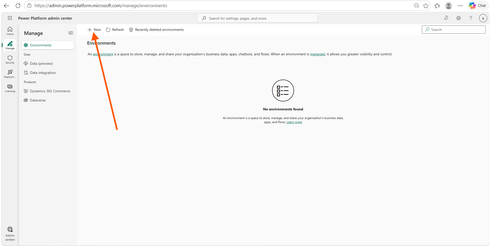
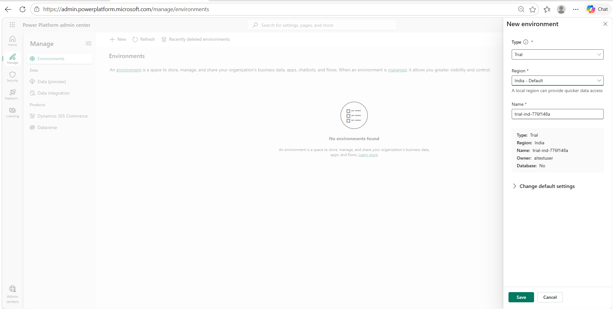
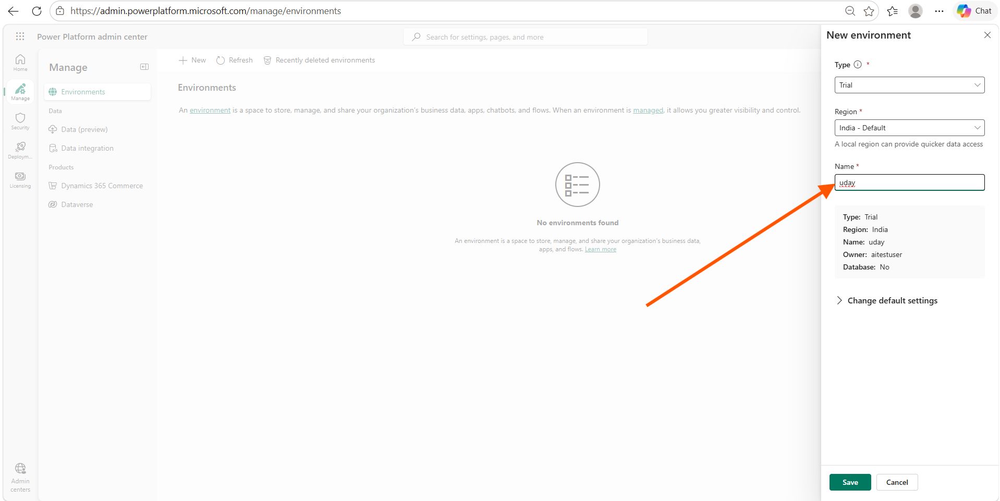
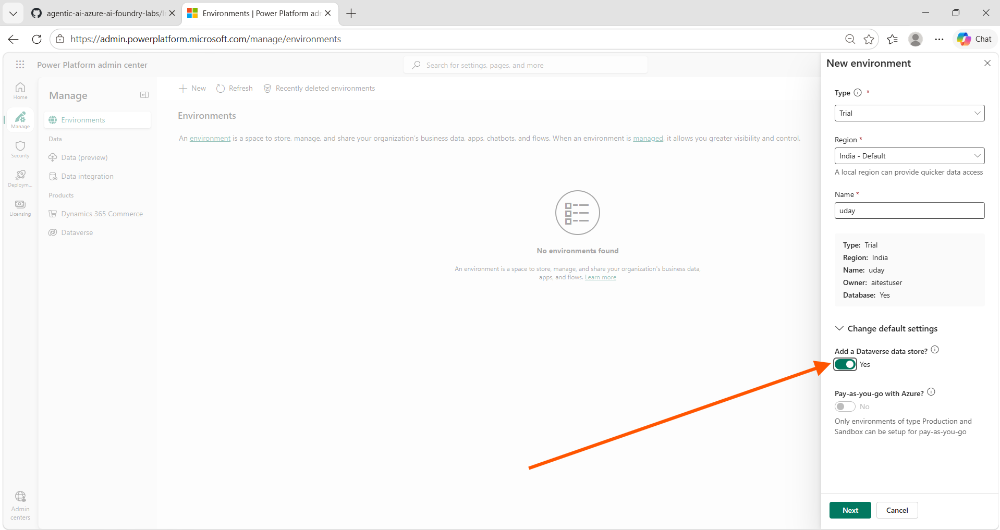
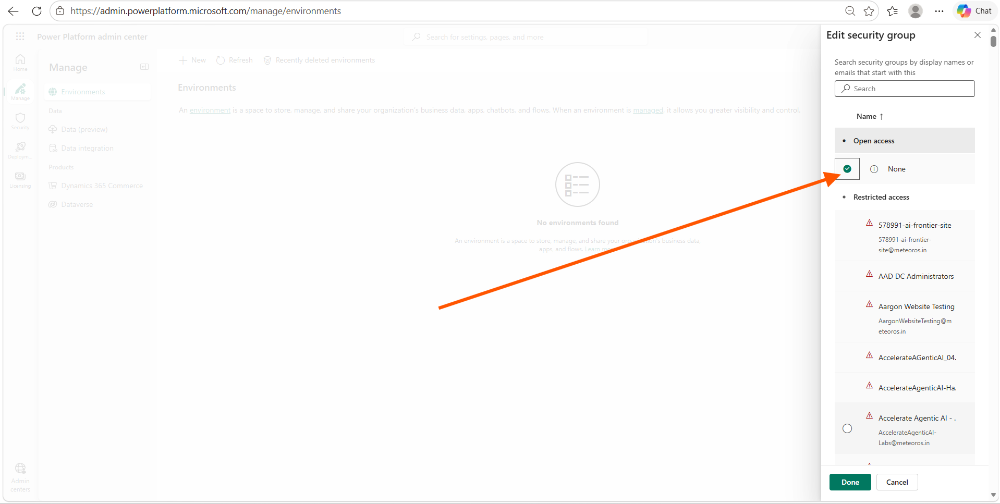
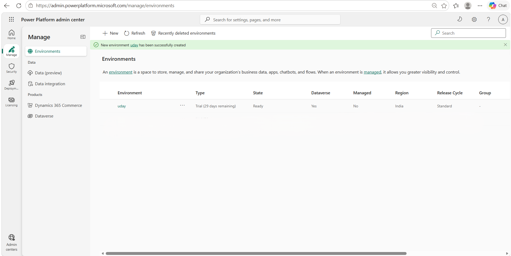
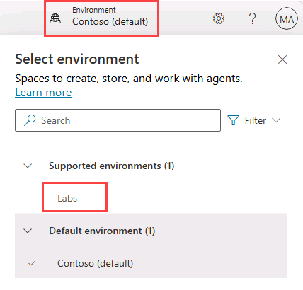
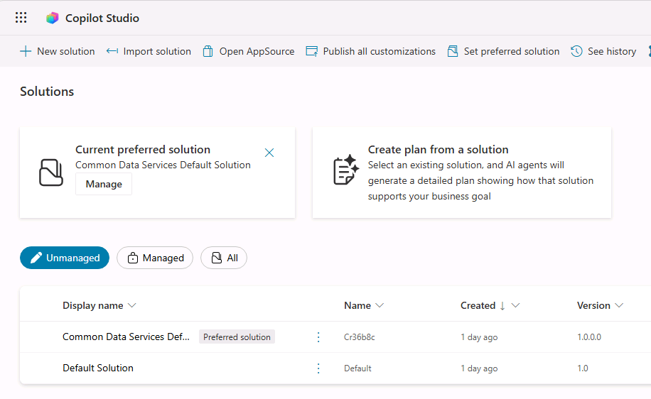

---
lab:
  title: ILT Setup
  module: Introduction
  description: In this exercise, you will access the Microsoft Copilot Studio portal and create an environment and solution to use throughout the remaining labs.
  duration: 10 minutes
  level: 200
  islab: true
  primarytopics:
    - Microsoft Copilot
    - Microsoft Copilot Studio
---

## Exercise 1 - Create a Power Platform environment

### Task 1.1 - Power Platform Admin Center

Before you start the lab exercises, you must create a development environment for you to work in.

1. Open a web browser, navigate to `https://admin.powerplatform.microsoft.com/manage/environments`, and sign in using your credentials for this exercise.
1. If prompted, choose the option to stay signed in.
1. Close any pop-up messages that are displayed.

### Task 1.2 - Create a new environment

1. In the **Environments** page, select **+ New**.
   
1. In the **New environment** panel, set **Type** to Trial and **Region** to the default region shown (a local region provides quicker data access).
   
1. Enter your name in the **Name** field.
   
1. Expand **Change default settings**. You'll see **Add a Dataverse data store?** and **Pay-as-you-go with Azure?**. Toggle **Add a Dataverse data store?** to **Yes**.
   
   > [!NOTE]
   > Pay-as-you-go with Azure is unavailable for Trial environments — only Production and Sandbox environments support this setting.

1. Select **Next**. In the **Add Dataverse** panel, set the following:
   - **Language**: leave as it is if already English (United States), otherwise select English (United States) and move to the next field
   - **Currency**: leave as default
   - **Security group**: Click **+ Select** and in **Edit security group** find **open access** click **None** and Click **Done**
   
   - **URL**: leave as default
   - **Enable Dynamics 365 apps?**: leave as it is (locked to No), move to the next field
   - **Deploy sample apps and data?**: No

   > [!NOTE]
   > Currency defaults based on your region (for example, INR for India). Enable Dynamics 365 apps is disabled for Trial environments — it's only available for Production or Sandbox environments.

1. Select **Save** and wait until the environment state is **Ready** (use **Refresh** to update the display).

   > [!NOTE]
   > Environment provisioning can take several minutes depending on tenant configuration.

   

### Task 1.3 - Access Copilot Studio

1. In a new browser tab, navigate to `https://copilotstudio.microsoft.com/` and sign in if prompted.

   > [!NOTE]
   > If Copilot Studio doesn't load your environment, get the environment ID (GUID) from the URL on the environment's page at `https://admin.powerplatform.microsoft.com/manage/environments`, then open `https://copilotstudio.microsoft.com/environments/<your-environment-id>/home` directly.

1. If prompted, select **Get Started** and keep the default country or region settings.
1. Skip any welcome messages.
1. In the upper right corner of the page, use the Environment Selector to switch to the environment you created.

   

### Task 1.4 - Create a solution

1. In the left navigation pane, select the ellipses (**...**), then select **Solutions**.
1. Confirm you see the *Default Solution* and *Common Data Services Default Solution* listed.

   

1. Select **+ New solution**.
1. Enter **`Lab Exercises`** as the **Display name**, and confirm **Name** auto-populates.
1. Select **+ New publisher** below the **Publisher** drop-down.
1. Enter `Fabrikam_unique_Suffix` for Display name, `fabrikam_unique_suffix` for Name, and `fab` for Prefix, then select **Save**.
1. Confirm **Fabrikam (fabrikam)** is selected in the **Publisher** drop-down.
1. Select the **Set as your preferred solution** checkbox.

   > [!NOTE]
   > Setting this as your preferred solution ensures new assets created during later labs are added to the Lab Exercises solution by default.

   

1. Select **Create**.
1. Close the **Solutions** browser tab, then refresh the **Copilot Studio** page.

You now have a Power Platform environment and solution to work in.